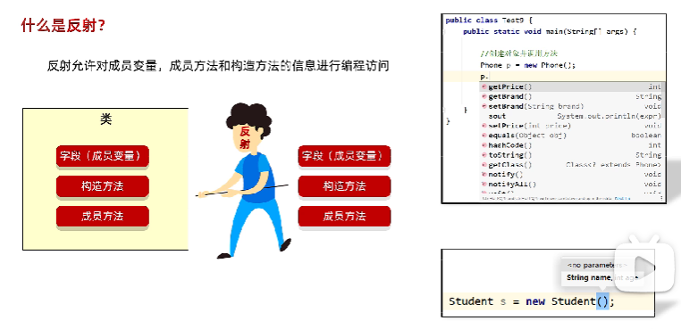
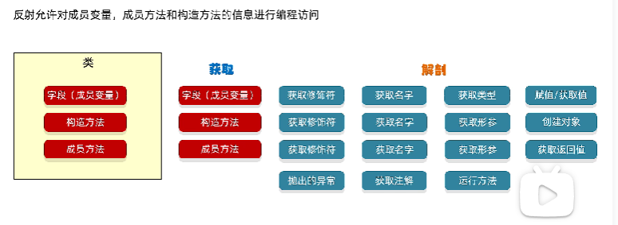
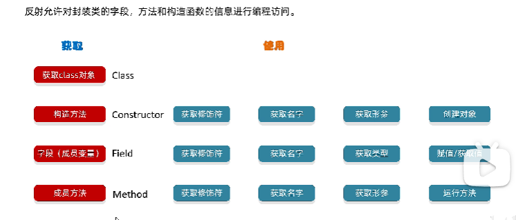
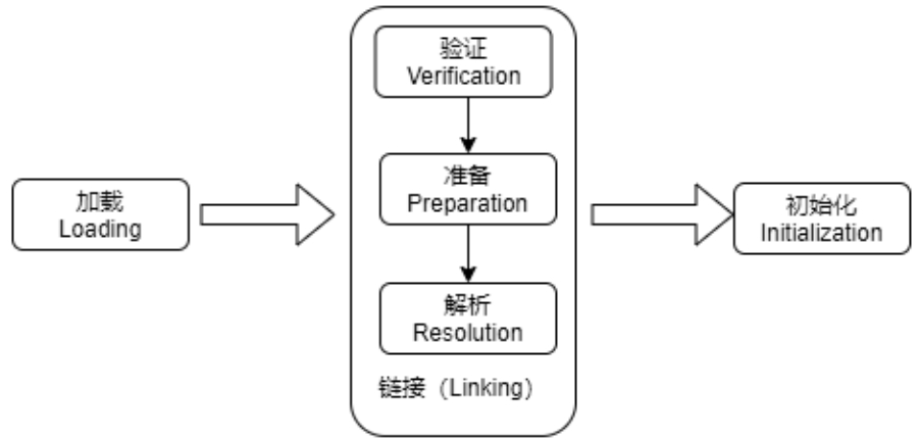

# 1. 反射

## 1.1 反射的概述：

- **专业的解释：**
  - 反射（Reflection）是 Java 的核心特性之一，其核心功能是在 **程序运行时** 动态获取类的完整信息（属性、方法、构造器等），并能 **动态调用任意对象的属性和方法**。
    - **动态获取类信息**：
      在运行时，可以获取任意类的 `Class` 对象，进而获取该类的所有成员（字段、方法、构造器等）。
    - **动态操作对象**：
      通过 `Class` 对象可以创建类的实例，调用其方法，甚至访问私有成员（需谨慎使用）。
    - **灵活性**：
      反射允许程序在编译时不知道具体类的情况下，通过运行时传入的类名字符串（如配置文件中的类名）动态加载和操作类。

- **通俗的理解：**

  - 反射的核心思想是 **“动态”**，它打破了 Java 编译期的类型限制，使程序在运行时能够灵活地处理未知的类和对象。以下是通俗的要点：

    - **无视修饰符限制**：

      - 通过反射可以访问类的 **私有字段** 和 **私有方法**（需使用 `setAccessible(true)` 绕过访问控制）。
      - 示例：即使某个方法是 `private`，反射也能调用它。

    - **与配置文件结合**：

      - 将类名、方法名等信息写入配置文件（如 `.properties` 或 XML 文件），程序运行时读取配置，动态创建对象并调用方法。
      - **优势**：无需修改代码即可调整程序行为，只需修改配置文件。
      - **典型场景**：框架开发（如 Spring、Hibernate）通过反射动态加载 Bean 或实体类。

    - **动态性示例**：

      - 假设有一个配置文件 `config.properties`

        ```
        className=com.example.MyService
        methodName=execute
        ```

      - 程序运行时读取配置，动态创建对象并调用方法

        ```
        // 读取配置文件
        Properties props = new Properties();
        props.load(new FileInputStream("config.properties"));
        String className = props.getProperty("className");
        String methodName = props.getProperty("methodName");
        
        // 反射创建对象并调用方法
        Class<?> clazz = Class.forName(className);
        Object obj = clazz.getDeclaredConstructor().newInstance();
        Method method = clazz.getMethod(methodName);
        method.invoke(obj); // 调用 execute 方法
        ```

- **反射的典型应用场景**
  - **框架开发**：
    - **Spring**：通过反射动态创建 Bean 实例，实现依赖注入。
    - **JUnit**：运行时发现并执行 `@Test` 注解的方法。
    - **MyBatis**：通过反射将数据库结果映射到 Java 对象。
  - **动态代理**：
    - AOP（面向切面编程）中通过反射生成代理类，拦截方法调用。
  - **通用工具类**：
    - 序列化/反序列化库（如 Jackson、Gson）利用反射读取字段值并转换为 JSON/XML。
  - **配置驱动的系统**：
    - 根据配置文件动态加载模块，实现插件化架构（如 IDE 插件系统）。







## 1.2 学习反射到底学什么？

反射都是从class字节码文件中获取的内容。

* 如何获取class字节码文件的对象
* 利用反射如何获取**构造方法（创建对象）**
* 利用反射如何获取成员变量（赋值，获取值）
* 利用反射如何获取成员方法（运行）

## 类的加载、链接和初始化

当程序主动使用某个类时，如果该类还未被加载到内存中，系统会通过加载、链接、初始化三个步骤来对该类进行初始化，如果没有意外，JVM将会连续完成这三个步骤，所以有时也把这三个步骤统称为类加载或类初始化



### 类的加载

系统可能在第一次使用某个类时加载该类，但也可能采用预先加载机制来预加载某个类，不管怎样，类的加载必须由类加载器完成，类加载器通常由JVM提供。除此之外，开发者可以通过继承ClassLoader基类来创建自己的类加载器。通过使用不同的类加载器，可以从不同来源加载类的二进制数据，通常有如下几种来源。

1. 从本地系统直接读取.class文件，这是绝大部分类的加载方法。
2. 从zip、jar等归档文件中加载.class文件，这种方式也是很常见的。
3. 通过网络下载.class文件或数据。
4. 从专有数据库中提取.class数据。
5. 将Java源文件数据上传到服务器中，动态编译为.class数据，并执行加载。

但是，不管类的字节码内容从哪里加载，加载的结果都一样，这些字节码内容加载到内存后都会将这些静态数据转换成方法区的运行时数据结构，然后生成一个代表这个类的java.lang.Class对象，作为方法区中类数据的访问入口（引用地址），访问和使用类数据只能通过这个Class对象。

### 类的链接

当类被加载之后，系统为其生成一个对应的Class对象，接着将会进入链接阶段，链接阶段负责把类的二进制数据合并到JVM的运行状态之中。类链接又可以分为如下三个阶段。

1. 验证：确保加载的类信息符合JVM规范，如以cafebabe开头，没有安全方面的问题。
2. 准备：正式为类变量(Static)分配内存并设置类变量默认初始值的阶段，这些内存都将在方法区中进行分配。
3. 解析：虚拟机常量池内的符号引用（常量名）替换为直接引用（地址）的过程。

### 类的初始化

类的初始化主要就是对静态的类变量进行初始化，有以下几种。

1. 执行类构造器＜clinit＞( )方法的过程。类构造器＜clinit＞( )方法是由编译器自动收集类中所有类变量的显式赋值动作和静态代码块中的语句合并产生的。
2. 当初始化一个类时，如果发现其父类还没有进行初始化，则需要先触发其父类的初始化。
3. 虚拟机会保证一个类的＜clinit＞( )方法在多线程环境中被正确加锁和同步。

#### 类的主动使用

1. 当虚拟机启动，先初始化主方法所在的类。

   ```
   public class A{
       static{
           System.out.println("init...A");
       }
       public static void main(String[] args){
       
       }
   }
   ```

   - **输出**：`init...A`
   - **原因**：JVM启动时，会加载并初始化包含 `main` 方法的类（主类），因此静态代码块会执行。

2. 当创建一个类的实例对象时，如果这个类没有初始化，就会先初始化这个类。

   ```
   class B{
       static{
           System.out.println("init...B");
       }
   }
   public class TestB{
       public static void main(String[] args){
           new B();// 创建实例
       }
   }
   ```

   - **输出**：`init...B`
   - **原因**：创建类 `B` 的实例时，若 `B` 未初始化，JVM会先加载、链接并初始化 `B`，执行静态代码块。

3. 当使用某个类的静态成员时，会先初始化该类

   ```
   //调用某个类的静态变量（final的常量除外）和静态方法
   //会先初始化这个类
   class C{
       public static int num=10;// 非final静态变量
       static{
           System.out.println("init...C");
       }
   }
   public class TestC{
       public static void main(String[] args){
           System.out.println(C.num);// 访问静态变量
       }
   }
   ```

   - **输出**：`init...C`
     `10`
   - **原因**：访问类 `C` 的静态变量（非final）会触发其初始化，执行静态代码块。
   - **注意**： 如果 `num` 是 `final static` 且值在编译期已知（如 `public static final int num = 10;`），则不会触发初始化，因为值会被直接内联到调用类的常量池中。

4. 当使用反射相关API动态使用某个类时，会先对该类进行初始化。

   ```
   class D{
      static{
          System.out.println("init..D");
      }
   }
   public class TestD{
       public static void main(String[] args) throws classNotFoundEXception{
           ClassLoader c1=ClassLoader.getSystemClassLoader();
           c1.loadClass("com.atguigu.section01.demo2.D");//该句不会造成类初始化，只是加载类
           
           System.out.println("类加载已完成")
           class.forName("com.section01.demo2.D");//会导致类初始化
       }
   }
   ```

   - `ClassLoader.loadClass()`：仅触发类的**加载和链接**，不执行初始化。
   - `Class.forName()`：默认会触发类的**初始化**（可通过第二个参数 `initialize=false` 禁用）。

5. 当初始化子类时，如果父类没有被初始化，则会先初始化父类。

   ```
   class Parent {
       static {
           System.out.println("Parent 初始化");
       }
   }
   class Child extends Parent {
       static {
           System.out.println("Child 初始化");
       }
   }
   public class Test {
       public static void main(String[] args) {
           new Child(); // 创建子类实例
       }
   }
   ```

   - **输出**：

     `Parent 初始化`
     `Child 初始化`

   - **原因**：初始化子类时，若父类未初始化，JVM会先递归初始化父类，再初始化子类。

#### 类的被动使用

**被动使用**不会触发类的初始化，但可能导致类的**加载和链接**（即加载和验证、准备阶段）。以下是常见的被动使用场景：

**(1) 引用静态常量不会触发类初始化**

- **场景**：访问 `final static` 常量（编译期常量）。

- **原因**：如果一个类的 `static final` 字段在编译期已确定值（如基本类型或字符串），JVM会在**编译阶段**将该常量值直接写入调用类的常量池。此时调用类直接使用常量池中的值，而**无需加载或初始化**定义该常量的类。

- 示例：

  ```
  class Constants {
      static {
          System.out.println("Constants initialized");
      }
      public static final int VALUE = 100;
  }
  
  public class Test {
      public static void main(String[] args) {
          System.out.println(Constants.VALUE); // 不会触发 Constants 类的初始化
      }
  }
  ```

**(2) 通过子类访问父类的静态字段**

- **场景**：通过子类引用父类的静态字段。

- **原因**：静态字段属于定义它的类（父类）。访问父类的静态字段时，JVM会直接加载并初始化父类，而**子类不会被初始化**。

- 示例

  ```
  class Parent {
      static {
          System.out.println("Parent initialized");
      }
      public static int value = 123;
  }
  
  class Child extends Parent {
      static {
          System.out.println("Child initialized");
      }
  }
  
  public class Test {
      public static void main(String[] args) {
          System.out.println(Child.value); // 只初始化 Parent 类
      }
  }
  ```

**(3) 通过数组定义引用类**

- **场景**：定义数组类型。

- **原因**：数组本身是一个独立的类（如 `[Lcom.example.MyClass;`），但它的元素类型（`MyClass`）不会被加载或初始化。

- 示例

  ```
  class MyClass {
      static {
          System.out.println("MyClass initialized");
      }
  }
  
  public class Test {
      public static void main(String[] args) {
          MyClass[] arr = new MyClass[10]; // 不会触发 MyClass 初始化
          System.out.println(arr.length);
      }
  }
  ```

**(4) 通过 `ClassLoader.loadClass()` 加载类**

- **场景**：显式调用 `ClassLoader.loadClass()`。

- **原因**：`loadClass()` 方法仅触发类的**加载和链接**，但不会触发初始化。

- 示例

  ```
  class MyClass {
      static {
          System.out.println("MyClass initialized");
      }
  }
  
  public class Test {
      public static void main(String[] args) throws ClassNotFoundException {
          ClassLoader.getSystemClassLoader().loadClass("MyClass"); // 不会触发初始化
          System.out.println("Loaded MyClass");
      }
  }
  ```

## 1.3 获取字节码文件对象的三种方式

* Class这个类里面的静态方法forName（“全类名”）**（最常用）**。**Class.forName("全类名")**
* 通过class属性获取  。**类名.class**
* 通过对象获取字节码文件对象。**对象.getClass()**
* 调用类加载对象的`loadClass(String name)`方法，该方法需要传入一个字符串参数，该参数是某个类的全限定名，该方法适用于数组以外的任意引用数据类型。

代码示例：

```java
//1.Class这个类里面的静态方法forName
//Class.forName("类的全类名")： 全类名 = 包名 + 类名
Class clazz1 = Class.forName("com.itheima.reflectdemo.Student");
//源代码阶段获取 --- 先把Student加载到内存中，再获取字节码文件的对象
//clazz 就表示Student这个类的字节码文件对象。
//就是当Student.class这个文件加载到内存之后，产生的字节码文件对象


//2.通过class属性获取
//类名.class
Class clazz2 = Student.class;

//因为class文件在硬盘中是唯一的，所以，当这个文件加载到内存之后产生的对象也是唯一的
System.out.println(clazz1 == clazz2);//true


//3.通过Student对象获取字节码文件对象
Student s = new Student();
Class clazz3 = s.getClass();
System.out.println(clazz1 == clazz2);//true
System.out.println(clazz2 == clazz3);//true

class<?>c4=ClassLoader.getSystemClassLoader().loadClass("com.itheima.reflectdemo.Student")
```

## 1.4 字节码文件和字节码文件对象

- java文件：就是我们自己编写的java代码。

- 字节码文件：就是通过java文件编译之后的class文件（是在硬盘上真实存在的，用眼睛能看到的）

- 字节码文件对象：当class文件加载到内存之后，虚拟机自动创建出来的对象。

- 这个对象里面至少包含了：构造方法，成员变量，成员方法。

- 而我们的反射获取的是什么？字节码文件对象，这个对象在内存中是唯一的。

## 获取类信息

### **ClassLoader getClassLoader()**获取某个类的加载器

1. 方法作用
   - `ClassLoader getClassLoader()` 是 `Class` 类的一个方法，用于返回 **加载该类的类加载器**。类加载器在 Java 中负责将类的字节码文件（`.class`）加载到 JVM 中，并解析类的依赖关系。
2. 返回值说明
   - **返回 `null` 的情况**：
     - **基本数据类型**（如 `int`, `double` 等）和 `void` 类型。
     - **`rt.jar` 包中的类**（如 `java.lang.Object`, `java.util.ArrayList` 等），这些类由 **引导类加载器（Bootstrap ClassLoader）** 加载。
     - **数组类型本身**（如 `int[]`, `String[]` 等），数组的类加载器由其元素类型的类加载器决定。
   - **返回非 `null` 的情况**：
     - **用户自定义类**（如 `com.example.MyClass`），这些类由 **应用程序类加载器（Application ClassLoader）** 加载。
     - **第三方库中的类**（如 `org.apache.commons.lang3.StringUtils`），这些类由 **扩展类加载器（Extension ClassLoader）** 或应用程序类加载器加载。

3. 类加载器的层级结构

   Java 的类加载器采用 **双亲委派模型**，层级关系如下：

   - Bootstrap ClassLoader（引导类加载器）：
     - 负责加载 Java 核心类库（如 `rt.jar`）。
     - 实现上通常由 C/C++ 编写，是 JVM 的一部分。
     - **`getClassLoader()` 返回 `null`**。

   - Extension ClassLoader（扩展类加载器）：
     - 负责加载 `$JAVA_HOME/lib/ext` 目录下的类库。

   - Application ClassLoader（应用程序类加载器）：
     - 负责加载用户类路径（`-classpath` 或 `-cp`）指定的类。

4. 数组类型的类加载器

   数组类型的类加载器由其 **元素类型的类加载器** 决定：

   - 如果元素类型是 `Object`（由引导类加载器加载），则数组的类加载器也是 `null`。
   - 如果元素类型是用户自定义类（由应用程序类加载器加载），则数组的类加载器与用户自定义类的相同。

5. 示例代码

   ```
   public class ClassLoaderDemo {
       public static void main(String[] args) {
           // 基本数据类型
           System.out.println("int.class 的类加载器: " + int.class.getClassLoader()); // null
           System.out.println("void.class 的类加载器: " + void.class.getClassLoader()); // null
   
           // rt.jar 包中的类
           System.out.println("Object.class 的类加载器: " + Object.class.getClassLoader()); // null
   
           // 用户自定义类
           System.out.println("ClassLoaderDemo.class 的类加载器: " + ClassLoaderDemo.class.getClassLoader());
           // 输出示例: sun.misc.Launcher$AppClassLoader@18b4aac2
   
           // 数组类型
           System.out.println("String[].class 的类加载器: " + String[].class.getClassLoader()); // null（String 由引导类加载器加载）
           System.out.println("ClassLoaderDemo[].class 的类加载器: " + ClassLoaderDemo[].class.getClassLoader());
           // 输出示例: sun.misc.Launcher$AppClassLoader@18b4aac2（与 ClassLoaderDemo 相同）
       }
   }
   ```

   - 基本数据类型和 `void`：
     - `int.class` 和 `void.class` 的类加载器为 `null`，因为它们由引导类加载器直接加载。
   - `Object` 类：
     - `Object` 是 `rt.jar` 中的类，由引导类加载器加载，因此返回 `null`。
   - 用户自定义类：
     - `ClassLoaderDemo.class` 的类加载器是应用程序类加载器（`AppClassLoader`）。
   - 数组类型：
     - `String[]` 的类加载器为 `null`，因为 `String` 由引导类加载器加载。
     - `ClassLoaderDemo[]` 的类加载器与 `ClassLoaderDemo` 相同（`AppClassLoader`）。

### 获取包名和类型名

**1. 方法概述**

- **`public Package getPackage()`**
   返回该类所属的 **`Package` 对象**。可以通过 `Package.getName()` 获取包名（字符串形式）。
  - 返回 `null` 的情况：
    - 基本数据类型（如 `int`, `double`）或 `void`。
    - 数组类型（如 `String[]`）。
- **`public String getName()`**
   返回该类的 **全限定名字符串**（包括包名、类名、数组维度等），格式取决于类的类型。
  - 返回值规则：
    1. **非数组的引用类型**：返回 **二进制名称**（`包名.类名`）。
    2. **基本数据类型或 `void`**：返回对应的 **Java 关键字**（如 `int`, `void`）。
    3. **数组类型**：返回 **内部形式名称**（以 `[` 表示数组维度，元素类型名编码）。

**2. 示例代码与输出分析**

```
public class PackageNameDemo {
    public static void main(String[] args) {
        // 1. 非数组的引用类型
        Class<?> clazz1 = String.class;
        System.out.println("getPackage(): " + clazz1.getPackage().getName()); // java.lang
        System.out.println("getName(): " + clazz1.getName()); // java.lang.String

        // 2. 基本数据类型
        Class<?> clazz2 = int.class;
        System.out.println("getPackage(): " + clazz2.getPackage()); // null
        System.out.println("getName(): " + clazz2.getName()); // int

        // 3. void 类型
        Class<?> clazz3 = void.class;
        System.out.println("getPackage(): " + clazz3.getPackage()); // null
        System.out.println("getName(): " + clazz3.getName()); // void

        // 4. 数组类型
        Class<?> clazz4 = String[].class;
        System.out.println("getPackage(): " + clazz4.getPackage()); // null
        System.out.println("getName(): " + clazz4.getName()); // [Ljava.lang.String;

        // 5. 多维数组
        Class<?> clazz5 = String[][].class;
        System.out.println("getName(): " + clazz5.getName()); // [[Ljava.lang.String;
    }
}
```

**输出结果说明**

| 类型                         | `getPackage()` | `getName()`            |
| ---------------------------- | -------------- | ---------------------- |
| **`String`**（引用类型）     | `java.lang`    | `java.lang.String`     |
| **`int`**（基本类型）        | `null`         | `int`                  |
| **`void`**（特殊类型）       | `null`         | `void`                 |
| **`String[]`**（一维数组）   | `null`         | `[Ljava.lang.String;`  |
| **`String[][]`**（二维数组） | `null`         | `[[Ljava.lang.String;` |

4. **数组类型名称的编码规则**

   Java 使用 **内部形式名称**（Internal Form）表示数组类型，规则如下：

   1. 一维数组：`[`+ 元素类型的内部形式。
      - 示例：`String[]`→`[Ljava.lang.String;`
        - `[` 表示数组，`L` 表示引用类型，`java.lang.String` 是元素类型，`;` 结尾。
   2. 多维数组：多个`[`表示数组维度。
      - 示例：`String[][]` → `[[Ljava.lang.String;`
   3. 基本类型数组：直接使用对应的基本类型关键字。
      - 示例：`int[]` → `[I`，`double[][]` → `[[D`。

   ##### **元素类型编码对照表**

   | Java 类型 | 内部形式编码                              |
   | --------- | ----------------------------------------- |
   | `byte`    | `B`                                       |
   | `char`    | `C`                                       |
   | `double`  | `D`                                       |
   | `float`   | `F`                                       |
   | `int`     | `I`                                       |
   | `long`    | `J`                                       |
   | `short`   | `S`                                       |
   | `boolean` | `Z`                                       |
   | 引用类型  | `L全限定类名;`（如 `Ljava.lang.String;`） |

### 获取类型修饰符

1. 方法作用

   `getModifiers()` 是 `Class` 类的一个方法，用于返回 **类或接口的修饰符**，以 **整数编码** 的形式表示。修饰符包括：

   - `public`, `protected`, `private`（访问控制）
   - `static`, `final`, `abstract`（类/方法/字段的属性）
   - `interface`（接口）
   - 其他修饰符（如 `strictfp`）

2. 修饰符编码规则

   Java 使用 **按位或（bitwise OR）** 的方式将多个修饰符合并为一个整数。每个修饰符对应一个唯一的位掩码（bitmask）：

   | 修饰符      | 对应的位掩码值（二进制） | 十进制值 |
   | ----------- | ------------------------ | -------- |
   | `public`    | 0b0000000000000001       | 1        |
   | `protected` | 0b0000000000000010       | 2        |
   | `private`   | 0b0000000000000100       | 4        |
   | `static`    | 0b0000000000001000       | 8        |
   | `final`     | 0b0000000000010000       | 16       |
   | `abstract`  | 0b0000000010000000       | 1024     |
   | `interface` | 0b0000001000000000       | 512      |
   | `strictfp`  | 0b0000100000000000       | 4096     |

   **示例**：

   - `public abstract class MyClass` 的修饰符整数为 `1 + 1024 = 1025`。
   - `public static final int MAX = 100;` 的修饰符整数为 `1 + 8 + 16 = 25`。

3. 解码修饰符

   使用 `java.lang.reflect.Modifier` 类的方法对 `getModifiers()` 返回的整数进行解码：

   | 方法                        | 作用                   |
   | --------------------------- | ---------------------- |
   | `Modifier.isPublic(int)`    | 判断是否为 `public`    |
   | `Modifier.isPrivate(int)`   | 判断是否为 `private`   |
   | `Modifier.isProtected(int)` | 判断是否为 `protected` |
   | `Modifier.isStatic(int)`    | 判断是否为 `static`    |
   | `Modifier.isFinal(int)`     | 判断是否为 `final`     |
   | `Modifier.isAbstract(int)`  | 判断是否为 `abstract`  |
   | `Modifier.isInterface(int)` | 判断是否为 `interface` |
   | `Modifier.isStrict(int)`    | 判断是否为 `strictfp`  |

4. 特殊规则

   - **数组类的修饰符规则**：

     - 数组的 `public`、`private` 和 `protected` 修饰符与其 **元素类型** 的修饰符相同。

       - 示例：
         - `String[]` 的 `public` 修饰符与 `String` 类的 `public` 修饰符一致。
         - 如果元素类型是 `private`（如某个内部类的私有数组），则数组的 `private` 修饰符为 `true`。
       - **原因**：数组的可见性由其元素类型的可见性决定，因为数组是基于元素类型构建的。

     - 数组的 `final` 修饰符始终为 `true`（数组在 Java 中是 **不可变的**（一旦创建，长度无法更改），且数组类型不能被继承（隐式 `final`））。

       - 示例：

         ```
         Class<?> arrayClass = String[].class;
         System.out.println(Modifier.isFinal(arrayClass.getModifiers())); // true
         ```

     - 接口修饰符始终为 `false`（数组不是接口类型，而是对象类型（`java.lang.Object` 的子类））。

   - **基本数据类型和 `void`**：

     - `public` 修饰符始终为 `true`。

       - **原因**：基本数据类型（如 `int`, `double`）和 `void` 是 Java 语言内置的公共类型，对所有类可见。

       - 示例：

         ```
         Class<?> intClass = int.class;
         System.out.println(Modifier.isPublic(intClass.getModifiers())); // true
         ```

     - `protected` 和 `private` 修饰符始终为 `false`。

     - `final` 修饰符始终为 `true`。基本数据类型是 **不可变的**，且不能被继承或修改。

     - 接口修饰符始终为 `false`。基本数据类型和 `void` 不是接口类型

6. 示例代码

   ```
   import java.lang.reflect.Modifier;
   
   public class ModifierDemo {
       public static void main(String[] args) {
           // 1. 公共抽象类
           Class<?> clazz1 = AbstractClass.class;
           int modifiers1 = clazz1.getModifiers();
           System.out.println("AbstractClass 修饰符:");
           System.out.println("public: " + Modifier.isPublic(modifiers1)); // true
           System.out.println("abstract: " + Modifier.isAbstract(modifiers1)); // true
           System.out.println("final: " + Modifier.isFinal(modifiers1)); // false
   
           // 2. 私有静态内部类
           Class<?> clazz2 = PrivateInnerClass.class;
           int modifiers2 = clazz2.getModifiers();
           System.out.println("\nPrivateInnerClass 修饰符:");
           System.out.println("private: " + Modifier.isPrivate(modifiers2)); // true
           System.out.println("static: " + Modifier.isStatic(modifiers2)); // true
   
           // 3. 接口
           Class<?> clazz3 = MyInterface.class;
           int modifiers3 = clazz3.getModifiers();
           System.out.println("\nMyInterface 修饰符:");
           System.out.println("interface: " + Modifier.isInterface(modifiers3)); // true
   
           // 4. 数组类型
           Class<?> clazz4 = String[].class;
           int modifiers4 = clazz4.getModifiers();
           System.out.println("\nString[] 修饰符:");
           System.out.println("public: " + Modifier.isPublic(modifiers4)); // true（与 String 一致）
           System.out.println("final: " + Modifier.isFinal(modifiers4)); // true（数组默认 final）
   
           // 5. 基本数据类型
           Class<?> clazz5 = int.class;
           int modifiers5 = clazz5.getModifiers();
           System.out.println("\nint 修饰符:");
           System.out.println("public: " + Modifier.isPublic(modifiers5)); // true
           System.out.println("final: " + Modifier.isFinal(modifiers5)); // true
           System.out.println("interface: " + Modifier.isInterface(modifiers5)); // false
       }
   
       // 示例类定义
       public abstract static class AbstractClass {}
       private static class PrivateInnerClass {}
       interface MyInterface {}
   }
   ```

### 获取父类或父接口

下面是一个示例代码，演示如何使用 `getSuperclass()` 和 `getInterfaces()` 方法来获取某个类的父类和实现的接口信息：

```
import java.util.ArrayList;
import java.util.List;

// 定义一个接口
interface MyInterface1 {
    void method1();
}

interface MyInterface2 {
    void method2();
}

// 一个父类
class ParentClass {
    // 父类内容
}

// 一个实现多个接口并继承父类的子类
class ChildClass extends ParentClass implements MyInterface1, MyInterface2 {
    public void method1() {
        System.out.println("MyInterface1 method1");
    }

    public void method2() {
        System.out.println("MyInterface2 method2");
    }
}

public class ClassInfoExample {
    public static void main(String[] args) {
        // 获取 ChildClass 的 Class 对象
        Class<?> clazz = ChildClass.class;

        // 获取父类
        Class<?> superClass = clazz.getSuperclass();
        if (superClass != null) {
            System.out.println("父类: " + superClass.getName());
        } else {
            System.out.println("该类没有父类（可能是 Object、接口、基本数据类型或 void）");
        }

        // 获取实现的接口
        Class<?>[] interfaces = clazz.getInterfaces();
        if (interfaces.length > 0) {
            System.out.println("实现的接口:");
            for (Class<?> intf : interfaces) {
                System.out.println(" - " + intf.getName());
            }
        } else {
            System.out.println("该类没有实现任何接口");
        }
    }
}
```

解释：

- `getSuperclass()`：返回 `ChildClass` 所继承的父类 `ParentClass`。
- `getInterfaces()`：返回 `ChildClass` 所实现的所有接口，顺序与 `implements` 子句中声明的顺序一致。

注意事项：

- 如果你传入的是一个接口（如 `MyInterface1.class`），那么 `getSuperclass()` 返回 `null`，因为接口没有父类（除了 `Object`）。
- 如果你传入的是基本数据类型（如 `int.class`）或 `void.class`，`getSuperclass()` 同样返回 `null`。
- 如果你传入的是数组类型（如 `new int[10].getClass()`），`getSuperclass()` 返回 `Object.class`，因为数组类型在 Java 中继承自 `Object`。

### 获取内部类或外部类信息

| 方法名称                                 | 功能说明                                                     |
| ---------------------------------------- | ------------------------------------------------------------ |
| `public Class<?>[] getClasses()`         | 返回一个 `Class` 数组，表示**该类中所有 public 的成员类和接口（包括嵌套类、接口、枚举等）**，**包括从父类继承来的 public 成员类和接口**。 |
| `public Class<?>[] getDeclaredClasses()` | 返回一个 `Class` 数组，表示**该类中直接声明的所有成员类和接口**（包括 public、protected、default、private），**不包括继承的成员类和接口**。 |
| `public Class<?> getDeclaringClass()`    | 如果当前 `Class` 对象表示的是一个**成员类（嵌套类）或接口**，则返回其**外部类（enclosing class）**；否则返回 `null`。 |

1. `getClasses()` 方法

   ```
   class OuterClass {
       public class PublicInnerClass {}
       private class PrivateInnerClass {}
   }
   
   class SubClass extends OuterClass {}
   
   public class Test {
       public static void main(String[] args) {
           Class<?> clazz = SubClass.class;
           Class<?>[] classes = clazz.getClasses();
           for (Class<?> c : classes) {
               System.out.println(c.getName());
               //
           }
       }
   }
   ```

   - 输出：`OuterClass$PublicInnerClass`，因为它是 public 的，并且被继承。

2. `getDeclaredClasses()` 方法

   ```
   class OuterClass {
       public class PublicInnerClass {}
       private class PrivateInnerClass {}
   }
   
   public class Test {
       public static void main(String[] args) {
           Class<?> clazz = OuterClass.class;
           Class<?>[] classes = clazz.getDeclaredClasses();
           for (Class<?> c : classes) {
               System.out.println(c.getName());
               //输出：`OuterClass$PublicInnerClass `OuterClass$PrivateInnerClass`
           }
       }
   }
   ```

3. `getDeclaringClass()` 方法

   ```
   class OuterClass {
       public class PublicInnerClass {}
       public static class StaticInnerClass {}
   }
   
   public class Test {
       public static void main(String[] args) {
           Class<?> innerClass = OuterClass.PublicInnerClass.class;
           Class<?> outer = innerClass.getDeclaringClass();
           if (outer != null) {
               System.out.println("外部类是：" + outer.getName());
           } else {
               System.out.println("不是一个嵌套类");
           }
       }
   }
   ```

   输出：`外部类是：OuterClass`

### 获取构造方法

- 规则：
  - get表示获取
  - Declared表示私有
  - 最后的s表示所有，复数形式
  - 如果当前获取到的是私有的，必须要临时修改访问权限，否则无法使用

| 方法名                                                       | 说明                              |
| ------------------------------------------------------------ | --------------------------------- |
| Constructor<?>[] getConstructors()                           | 获得所有的构造（只能public修饰）  |
| Constructor<?>[] getDeclaredConstructors()                   | 获得所有的构造（包含private修饰） |
| Constructor<T> getConstructor(Class<?>... parameterTypes)    | 获取指定构造（只能public修饰）    |
| Constructor<T> getDeclaredConstructor(Class<?>... parameterTypes) | 获取指定构造（包含private修饰）   |

代码示例：

```java
public class ReflectDemo2 {
    public static void main(String[] args) throws ClassNotFoundException, NoSuchMethodException {
        //1.获得整体（class字节码文件对象）
        Class clazz = Class.forName("com.itheima.reflectdemo.Student");


        //2.获取构造方法对象
        //获取所有构造方法（public）
        Constructor[] constructors1 = clazz.getConstructors();
        for (Constructor constructor : constructors1) {
            System.out.println(constructor);
        }

        System.out.println("=======================");

        //获取所有构造（带私有的）
        Constructor[] constructors2 = clazz.getDeclaredConstructors();

        for (Constructor constructor : constructors2) {
            System.out.println(constructor);
        }
        System.out.println("=======================");

        //获取指定的空参构造
        Constructor con1 = clazz.getConstructor();
        System.out.println(con1);

        Constructor con2 = clazz.getConstructor(String.class,int.class);
        System.out.println(con2);

        System.out.println("=======================");
        //获取指定的构造(所有构造都可以获取到，包括public包括private)
        Constructor con3 = clazz.getDeclaredConstructor();
        System.out.println(con3);
        //了解 System.out.println(con3 == con1);
        //每一次获取构造方法对象的时候，都会新new一个。

        Constructor con4 = clazz.getDeclaredConstructor(String.class);
        System.out.println(con4);
    }
}
```

#### 1.6 获取构造方法并创建对象

- 通过以下两种方式创建 `Student` 的实例：

  - 方式一：使用 `Class.newInstance()`。要求类必须有无参构造器（默认构造器）

  - 方式二：使用 `Constructor.newInstance(Object...)`。可以调用任意构造器，灵活指定参数

  - 如果你的构造器是 `private`，可以这样访问：

    ```
    Constructor<?> privateConstructor = studentClass.getDeclaredConstructor(String.class);
    privateConstructor.setAccessible(true); // 打破封装
    Object student3 = privateConstructor.newInstance("李四");
    ```

    

代码示例：

```java
//首先要有一个javabean类
public class Student {
    private String name;

    private int age;


    public Student() {

    }

    public Student(String name) {
        this.name = name;
    }

    private Student(String name, int age) {
        this.name = name;
        this.age = age;
    }


    /**
     * 获取
     * @return name
     */
    public String getName() {
        return name;
    }

    /**
     * 设置
     * @param name
     */
    public void setName(String name) {
        this.name = name;
    }

    /**
     * 获取
     * @return age
     */
    public int getAge() {
        return age;
    }

    /**
     * 设置
     * @param age
     */
    public void setAge(int age) {
        this.age = age;
    }

    public String toString() {
        return "Student{name = " + name + ", age = " + age + "}";
    }
}


//测试类中的代码：
//需求1：
//获取空参，并创建对象

//1.获取整体的字节码文件对象
Class clazz = Class.forName("com.itheima.a02reflectdemo1.Student");
//2.获取空参的构造方法
Constructor con = clazz.getConstructor();
//3.利用空参构造方法创建对象
Student stu = (Student) con.newInstance();
System.out.println(stu);

// 方式二：使用 Constructor.newInstance() 创建对象（可调用任意构造器）
            System.out.println("=== 使用 Constructor.newInstance() 创建对象 ===");

            // 获取带参构造器：public Student(String name, int age)
            Constructor<?> constructor = studentClass.getConstructor(String.class, int.class);

            // 创建实例并传入参数
            Object student2 = constructor.newInstance("张三", 20);
            System.out.println(student2);


System.out.println("=============================================");

// 方式一：使用 Class.newInstance() 创建对象（必须有无参构造器）
            System.out.println("=== 使用 Class.newInstance() 创建对象 ===");
            Object student1 = studentClass.newInstance();
            System.out.println(student1);


//测试类中的代码：
//需求2：
//获取带参构造，并创建对象
//1.获取整体的字节码文件对象
Class clazz = Class.forName("com.itheima.a02reflectdemo1.Student");
//2.获取有参构造方法
Constructor con = clazz.getDeclaredConstructor(String.class, int.class);
//3.临时修改构造方法的访问权限（暴力反射）
con.setAccessible(true);
//4.直接创建对象
Student stu = (Student) con.newInstance("zhangsan", 23);
System.out.println(stu);
```

### 1.7 获取成员变量

- 规则：
  - get表示获取
  - Declared表示私有
  - 最后的s表示所有，复数形式
  - 如果当前获取到的是私有的，必须要临时修改访问权限，否则无法使用

方法名：

| 方法名                              | 说明                                         |
| ----------------------------------- | -------------------------------------------- |
| Field[] getFields()                 | 返回所有成员变量对象的数组（只能拿public的） |
| Field[] getDeclaredFields()         | 返回所有成员变量对象的数组，存在就能拿到     |
| Field getField(String name)         | 返回单个成员变量对象（只能拿public的）       |
| Field getDeclaredField(String name) | 返回单个成员变量对象，存在就能拿到           |

代码示例：

```java
public class ReflectDemo4 {
    public static void main(String[] args) throws ClassNotFoundException, NoSuchFieldException {
        //获取成员变量对象

        //1.获取class对象
        Class clazz = Class.forName("com.itheima.reflectdemo.Student");

        //2.获取成员变量的对象（Field对象)只能获取public修饰的
        Field[] fields1 = clazz.getFields();
        for (Field field : fields1) {
            System.out.println(field);
        }

        System.out.println("===============================");

        //获取成员变量的对象（public + private）
        Field[] fields2 = clazz.getDeclaredFields();
        for (Field field : fields2) {
            System.out.println(field);
        }

        System.out.println("===============================");
        //获得单个成员变量对象
        //如果获取的属性是不存在的，那么会报异常
        //Field field3 = clazz.getField("aaa");
        //System.out.println(field3);//NoSuchFieldException

        Field field4 = clazz.getField("gender");
        System.out.println(field4);

        System.out.println("===============================");
        //获取单个成员变量（私有）
        Field field5 = clazz.getDeclaredField("name");
        System.out.println(field5);

    }
}


public class Student {
    private String name;

    private int age;

    public String gender;

    public String address;


    public Student() {
    }

    public Student(String name, int age, String address) {
        this.name = name;
        this.age = age;
        this.address = address;
    }


    public Student(String name, int age, String gender, String address) {
        this.name = name;
        this.age = age;
        this.gender = gender;
        this.address = address;
    }

    /**
     * 获取
     * @return name
     */
    public String getName() {
        return name;
    }

    /**
     * 设置
     * @param name
     */
    public void setName(String name) {
        this.name = name;
    }

    /**
     * 获取
     * @return age
     */
    public int getAge() {
        return age;
    }

    /**
     * 设置
     * @param age
     */
    public void setAge(int age) {
        this.age = age;
    }

    /**
     * 获取
     * @return gender
     */
    public String getGender() {
        return gender;
    }

    /**
     * 设置
     * @param gender
     */
    public void setGender(String gender) {
        this.gender = gender;
    }

    /**
     * 获取
     * @return address
     */
    public String getAddress() {
        return address;
    }

    /**
     * 设置
     * @param address
     */
    public void setAddress(String address) {
        this.address = address;
    }

    public String toString() {
        return "Student{name = " + name + ", age = " + age + ", gender = " + gender + ", address = " + address + "}";
    }
}

```

#### 1.8 获取成员变量并获取值和修改值

| 方法                            | 功能说明                                                     |
| ------------------------------- | ------------------------------------------------------------ |
| `getXXX(Object obj)`            | 获取 `obj` 对象中该字段的值（适用于基本类型）                |
| `get(Object obj)`               | 获取 `obj` 对象中该字段的值（适用于引用类型）                |
| `setXXX(Object obj, Xxx value)` | 设置 `obj` 对象中该字段的值（适用于基本类型）                |
| `set(Object obj, Object value)` | 设置 `obj` 对象中该字段的值（适用于引用类型）                |
| `setAccessible(true)`           | 打破封装，允许访问 `private`、`protected`、默认访问权限的字段 |

代码示例：

```java
public class ReflectDemo5 {
    public static void main(String[] args) throws ClassNotFoundException, NoSuchFieldException, IllegalAccessException {
        Student s = new Student("zhangsan",23,"广州");
        Student ss = new Student("lisi",24,"北京");

        //需求：
        //利用反射获取成员变量并获取值和修改值

        //1.获取class对象
        Class clazz = Class.forName("com.itheima.reflectdemo.Student");

        //2.获取name成员变量
        //field就表示name这个属性的对象
        Field field = clazz.getDeclaredField("name");
        //临时修饰他的访问权限
        field.setAccessible(true);

        //3.设置(修改)name的值
        //参数一：表示要修改哪个对象的name？
        //参数二：表示要修改为多少？
        field.set(s,"wangwu");

        //3.获取name的值
        //表示我要获取这个对象的name的值
        String result = (String)field.get(s);

        //4.打印结果
        System.out.println(result);

        System.out.println(s);
        System.out.println(ss);

    }
}


public class Student {
    private String name;
    private int age;
    public String gender;
    public String address;


    public Student() {
    }

    public Student(String name, int age, String address) {
        this.name = name;
        this.age = age;
        this.address = address;
    }


    public Student(String name, int age, String gender, String address) {
        this.name = name;
        this.age = age;
        this.gender = gender;
        this.address = address;
    }

    /**
     * 获取
     * @return name
     */
    public String getName() {
        return name;
    }

    /**
     * 设置
     * @param name
     */
    public void setName(String name) {
        this.name = name;
    }

    /**
     * 获取
     * @return age
     */
    public int getAge() {
        return age;
    }

    /**
     * 设置
     * @param age
     */
    public void setAge(int age) {
        this.age = age;
    }

    /**
     * 获取
     * @return gender
     */
    public String getGender() {
        return gender;
    }

    /**
     * 设置
     * @param gender
     */
    public void setGender(String gender) {
        this.gender = gender;
    }

    /**
     * 获取
     * @return address
     */
    public String getAddress() {
        return address;
    }

    /**
     * 设置
     * @param address
     */
    public void setAddress(String address) {
        this.address = address;
    }

    public String toString() {
        return "Student{name = " + name + ", age = " + age + ", gender = " + gender + ", address = " + address + "}";
    }
}

```

代码示例：

```
public class Student {
    public String name;
    private int age;

    public Student(String name, int age) {
        this.name = name;
        this.age = age;
    }

    @Override
    public String toString() {
        return "Student{name='" + name + "', age=" + age + "}";
    }
}
```

```
import java.lang.reflect.Field;

public class FieldReflectionDemo {
    public static void main(String[] args) {
        try {
            // 创建 Student 实例
            Student student = new Student("张三", 20);

            // 获取 Class 对象
            Class<? extends Student> clazz = student.getClass();

            // 获取 public 字段 name
            Field nameField = clazz.getField("name");

            // 获取 public 字段的值
            String nameValue = (String) nameField.get(student);
            System.out.println("name 的原始值: " + nameValue);

            // 修改 public 字段的值
            nameField.set(student, "李四");
            System.out.println("修改后的 Student: " + student);

            // 获取 private 字段 age
            Field ageField = clazz.getDeclaredField("age");

            // 打破封装，访问私有字段
            ageField.setAccessible(true);

            // 获取 private 字段的值
            int ageValue = ageField.getInt(student);
            System.out.println("age 的原始值: " + ageValue);

            // 修改 private 字段的值
            ageField.setInt(student, 25);
            System.out.println("修改后的 Student: " + student);

        } catch (Exception e) {
            e.printStackTrace();
        }
    }
}
```

- 输出：

  ```
  name 的原始值: 张三
  修改后的 Student: Student{name='李四', age=20}
  age 的原始值: 20
  修改后的 Student: Student{name='李四', age=25}
  ```

  

### 1.9 获取成员方法

规则：

​	get表示获取

​	Declared表示私有

​	最后的s表示所有，复数形式

​	如果当前获取到的是私有的，必须要临时修改访问权限，否则无法使用

| 方法名                                                       | 说明                                         |
| ------------------------------------------------------------ | -------------------------------------------- |
| Method[] getMethods()                                        | 返回所有成员方法对象的数组（只能拿public的） |
| Method[] getDeclaredMethods()                                | 返回所有成员方法对象的数组，存在就能拿到     |
| Method getMethod(String name, Class<?>... parameterTypes)    | 返回单个成员方法对象（只能拿public的）       |
| Method getDeclaredMethod(String name, Class<?>... parameterTypes) | 返回单个成员方法对象，存在就能拿到           |

代码示例：

```java
public class ReflectDemo6 {
    public static void main(String[] args) throws ClassNotFoundException, NoSuchMethodException {
        //1.获取class对象
        Class<?> clazz = Class.forName("com.itheima.reflectdemo.Student");


        //2.获取方法
        //getMethods可以获取父类中public修饰的方法
        Method[] methods1 = clazz.getMethods();
        for (Method method : methods1) {
            System.out.println(method);
        }

        System.out.println("===========================");
        //获取所有的方法（包含私有）
        //但是只能获取自己类中的方法
        Method[] methods2 = clazz.getDeclaredMethods();
        for (Method method : methods2) {
            System.out.println(method);
        }

        System.out.println("===========================");
        //获取指定的方法（空参）
        Method method3 = clazz.getMethod("sleep");
        System.out.println(method3);

        Method method4 = clazz.getMethod("eat",String.class);
        System.out.println(method4);

        //获取指定的私有方法
        Method method5 = clazz.getDeclaredMethod("playGame");
        System.out.println(method5);
    }
}

```

#### 1.10 获取成员方法并运行

- 方法
  - Object invoke(Object obj, Object... args) ：运行方法
  - 参数一：用obj对象调用该方法
  - 参数二：调用方法的传递的参数（如果没有就不写）
  - 返回值：方法的返回值（如果没有就不写）

代码示例：

```java
package com.itheima.a02reflectdemo1;

import java.lang.reflect.InvocationTargetException;
import java.lang.reflect.Method;

public class ReflectDemo6 {
    public static void main(String[] args) throws ClassNotFoundException, NoSuchMethodException, InvocationTargetException, IllegalAccessException {
        //1.获取字节码文件对象
        Class clazz = Class.forName("com.itheima.a02reflectdemo1.Student");
		
        //2.获取一个对象
        //需要用这个对象去调用方法
        Student s = new Student();
        
        //3.获取一个指定的方法
        //参数一：方法名
        //参数二：参数列表，如果没有可以不写
        Method eatMethod = clazz.getMethod("eat",String.class);
        
        //运行
        //参数一：表示方法的调用对象
        //参数二：方法在运行时需要的实际参数
        //注意点：如果方法有返回值，那么需要接收invoke的结果
        //如果方法没有返回值，则不需要接收
        String result = (String) eatMethod.invoke(s, "重庆小面");
        System.out.println(result);

    }
}


public class Student {
    private String name;
    private int age;
    public String gender;
    public String address;


    public Student() {

    }

    public Student(String name) {
        this.name = name;
    }

    private Student(String name, int age) {
        this.name = name;
        this.age = age;
    }

    /**
     * 获取
     * @return name
     */
    public String getName() {
        return name;
    }

    /**
     * 设置
     * @param name
     */
    public void setName(String name) {
        this.name = name;
    }

    /**
     * 获取
     * @return age
     */
    public int getAge() {
        return age;
    }

    /**
     * 设置
     * @param age
     */
    public void setAge(int age) {
        this.age = age;
    }

    public String toString() {
        return "Student{name = " + name + ", age = " + age + "}";
    }

    private void study(){
        System.out.println("学生在学习");
    }

    private void sleep(){
        System.out.println("学生在睡觉");
    }

    public String eat(String something){
        System.out.println("学生在吃" + something);
        return "学生已经吃完了，非常happy";
    }
}
```

### 获取泛型父类

在 Java 中，自从 **JDK 1.5** 引入泛型后，Java 反射 API 也随之扩展，新增了 `Type` 接口及其子接口，如：

- `ParameterizedType`：表示带泛型参数的类型（如 `List<String>`）
- `GenericArrayType`：表示泛型数组（如 `T[]`）
- `TypeVariable`：表示类型变量（如 `<T>` 中的 `T`）
- `WildcardType`：表示通配符类型（如 `? extends Number`）

这些类型用于**在运行时获取泛型信息**，尤其是**获取泛型父类**的信息。

方法说明：`getGenericSuperclass()`

🔹 方法定义：

```
public Type getGenericSuperclass()
```

 功能说明：

返回当前类的**直接父类的类型（包括泛型信息）**。

- 如果父类没有使用泛型，则返回值是 `Class` 类型。
- 如果父类使用了泛型，则返回值是 `ParameterizedType` 类型。
- 如果该类是 `Object`、接口、基本类型、数组类型，则返回 `null`。

 注意事项：

- 如果当前类是 `Object`、接口、基本类型或数组类型，则返回 `null`。
- 返回值是 `Type` 类型，可能需要向下转型为 `ParameterizedType` 来获取泛型参数。

示例代码：获取泛型父类

```
import java.lang.reflect.ParameterizedType;
import java.lang.reflect.Type;

// 定义一个泛型父类
class ParentClass<T1, T2> {
}

// 子类继承父类并指定泛型参数
class ChildClass extends ParentClass<String, Integer> {
}

public class GenericSuperclassExample {
    public static void main(String[] args) {
        // 获取子类的 Class 对象
        Class<?> clazz = ChildClass.class;

        // 获取泛型父类
        Type genericSuperclass = clazz.getGenericSuperclass();

        // 判断是否为 ParameterizedType
        if (genericSuperclass instanceof ParameterizedType) {
            ParameterizedType parameterizedType = (ParameterizedType) genericSuperclass;

            // 获取原始类型（即 ParentClass）
            Type rawType = parameterizedType.getRawType();
            System.out.println("原始类型: " + rawType);

            // 获取泛型参数
            Type[] actualTypeArguments = parameterizedType.getActualTypeArguments();
            for (int i = 0; i < actualTypeArguments.length; i++) {
                System.out.println("泛型参数 " + (i + 1) + ": " + actualTypeArguments[i]);
            }
        } else {
            System.out.println("父类没有使用泛型");
        }
    }
}
```

输出结果：

```
原始类型: class ParentClass
泛型参数 1: class java.lang.String
泛型参数 2: class java.lang.Integer
```

 说明：

- `getGenericSuperclass()` 返回的是 `Type`，这里是一个 `ParameterizedType`。
- `getRawType()` 获取的是父类的原始类型（即 `ParentClass`）。
- `getActualTypeArguments()` 获取的是泛型参数的实际类型（即 `String` 和 `Integer`）。

### 获取注解信息

| 方法名                                                       | 功能说明                                       |
| ------------------------------------------------------------ | ---------------------------------------------- |
| `Annotation[] getAnnotations()`                              | 返回此元素上存在的所有注解（包括从父类继承的） |
| `Annotation[] getDeclaredAnnotations()`                      | 返回此元素上声明的所有注解（不包括继承的）     |
| `<T extends Annotation> T getAnnotation(Class<T> annotationClass)` | 返回指定类型的注解，如果不存在则返回 `null`    |

------

注意事项：

- **只有生命周期为 `RetentionPolicy.RUNTIME` 的注解才能在运行时通过反射获取到**。

- 注解的生命周期由`@Retention`

  注解控制，可选值有：

  - `SOURCE`：仅保留在源码中，编译时丢弃（不能通过反射获取）
  - `CLASS`：保留在 `.class` 文件中，但 JVM 运行时不保留（不能通过反射获取）
  - `RUNTIME`：保留在运行时，可通过反射获取 

## 面试题：

​	你觉得反射好不好？好，有两个方向

​	第一个方向：无视修饰符访问类中的内容。但是这种操作在开发中一般不用，都是框架底层来用的。

​	第二个方向：反射可以跟配置文件结合起来使用，动态的创建对象，动态的调用方法。

## 1.11 练习泛型擦除（掌握概念，了解代码）

理解：（掌握）

​	集合中的泛型只在java文件中存在，当编译成class文件之后，就没有泛型了。

代码示例：（了解）

```java
package com.itheima.reflectdemo;

import java.lang.reflect.InvocationTargetException;
import java.lang.reflect.Method;
import java.util.ArrayList;

public class ReflectDemo8 {
    public static void main(String[] args) throws NoSuchMethodException, InvocationTargetException, IllegalAccessException {
        //1.创建集合对象
        ArrayList<Integer> list = new ArrayList<>();
        list.add(123);
//        list.add("aaa");

        //2.利用反射运行add方法去添加字符串
        //因为反射使用的是class字节码文件

        //获取class对象
        Class clazz = list.getClass();

        //获取add方法对象
        Method method = clazz.getMethod("add", Object.class);

        //运行方法
        method.invoke(list,"aaa");

        //打印集合
        System.out.println(list);
    }
}

```

## 1.12 练习：修改字符串的内容（掌握概念，了解代码）

在这个练习中，我需要你掌握的是字符串不能修改的真正原因。

字符串，在底层是一个byte类型的字节数组，名字叫做value

```java
private final byte[] value;
```

真正不能被修改的原因：final和private

final修饰value表示value记录的地址值不能修改。

private修饰value而且没有对外提供getvalue和setvalue的方法。所以，在外界不能获取或修改value记录的地址值。

如果要强行修改可以用反射：

代码示例：（了解）

```java
String s = "abc";
String ss = "abc";
// private final byte[] value= {97,98,99};
// 没有对外提供getvalue和setvalue的方法，不能修改value记录的地址值
// 如果我们利用反射获取了value的地址值。
// 也是可以修改的，final修饰的value
// 真正不可变的value数组的地址值，里面的内容利用反射还是可以修改的，比较危险

//1.获取class对象
Class clazz = s.getClass();

//2.获取value成员变量（private）
Field field = clazz.getDeclaredField("value");
//但是这种操作非常危险
//JDK高版本已经屏蔽了这种操作，低版本还是可以的
//临时修改权限
field.setAccessible(true);

//3.获取value记录的地址值
byte[] bytes = (byte[]) field.get(s);
bytes[0] = 100;

System.out.println(s);//dbc
System.out.println(ss);//dbc
```

## 1.13 练习，反射和配置文件结合动态获取的练习（重点）

需求: 利用反射根据文件中的不同类名和方法名，创建不同的对象并调用方法。

分析:

①通过Properties加载配置文件

②得到类名和方法名

③通过类名反射得到Class对象

④通过Class对象创建一个对象

⑤通过Class对象得到方法

⑥调用方法

代码示例：

```java
public class ReflectDemo9 {
    public static void main(String[] args) throws IOException, ClassNotFoundException, NoSuchMethodException, InvocationTargetException, InstantiationException, IllegalAccessException {
        //1.读取配置文件的信息
        Properties prop = new Properties();
        FileInputStream fis = new FileInputStream("day14-code\\prop.properties");
        prop.load(fis);
        fis.close();
        System.out.println(prop);

        String classname = prop.get("classname") + "";
        String methodname = prop.get("methodname") + "";

        //2.获取字节码文件对象
        Class clazz = Class.forName(classname);

        //3.要先创建这个类的对象
        Constructor con = clazz.getDeclaredConstructor();
        con.setAccessible(true);
        Object o = con.newInstance();
        System.out.println(o);

        //4.获取方法的对象
        Method method = clazz.getDeclaredMethod(methodname);
        method.setAccessible(true);

        //5.运行方法
        method.invoke(o);


    }
}

配置文件中的信息：
classname=com.itheima.a02reflectdemo1.Student
methodname=sleep
```

## 1.14 利用发射保存对象中的信息（重点）

```java
public class MyReflectDemo {
    public static void main(String[] args) throws IllegalAccessException, IOException {
    /*
        对于任意一个对象，都可以把对象所有的字段名和值，保存到文件中去
    */
       Student s = new Student("小A",23,'女',167.5,"睡觉");
       Teacher t = new Teacher("播妞",10000);
       saveObject(s);
    }

    //把对象里面所有的成员变量名和值保存到本地文件中
    public static void saveObject(Object obj) throws IllegalAccessException, IOException {
        //1.获取字节码文件的对象
        Class clazz = obj.getClass();
        //2. 创建IO流
        BufferedWriter bw = new BufferedWriter(new FileWriter("myreflect\\a.txt"));
        //3. 获取所有的成员变量
        Field[] fields = clazz.getDeclaredFields();
        for (Field field : fields) {
            field.setAccessible(true);
            //获取成员变量的名字
            String name = field.getName();
            //获取成员变量的值
            Object value = field.get(obj);
            //写出数据
            bw.write(name + "=" + value);
            bw.newLine();
        }

        bw.close();

    }
}
```

```java
public class Student {
    private String name;
    private int age;
    private char gender;
    private double height;
    private String hobby;

    public Student() {
    }

    public Student(String name, int age, char gender, double height, String hobby) {
        this.name = name;
        this.age = age;
        this.gender = gender;
        this.height = height;
        this.hobby = hobby;
    }

    /**
     * 获取
     * @return name
     */
    public String getName() {
        return name;
    }

    /**
     * 设置
     * @param name
     */
    public void setName(String name) {
        this.name = name;
    }

    /**
     * 获取
     * @return age
     */
    public int getAge() {
        return age;
    }

    /**
     * 设置
     * @param age
     */
    public void setAge(int age) {
        this.age = age;
    }

    /**
     * 获取
     * @return gender
     */
    public char getGender() {
        return gender;
    }

    /**
     * 设置
     * @param gender
     */
    public void setGender(char gender) {
        this.gender = gender;
    }

    /**
     * 获取
     * @return height
     */
    public double getHeight() {
        return height;
    }

    /**
     * 设置
     * @param height
     */
    public void setHeight(double height) {
        this.height = height;
    }

    /**
     * 获取
     * @return hobby
     */
    public String getHobby() {
        return hobby;
    }

    /**
     * 设置
     * @param hobby
     */
    public void setHobby(String hobby) {
        this.hobby = hobby;
    }

    public String toString() {
        return "Student{name = " + name + ", age = " + age + ", gender = " + gender + ", height = " + height + ", hobby = " + hobby + "}";
    }
}
```

```java
public class Teacher {
    private String name;
    private double salary;

    public Teacher() {
    }

    public Teacher(String name, double salary) {
        this.name = name;
        this.salary = salary;
    }

    /**
     * 获取
     * @return name
     */
    public String getName() {
        return name;
    }

    /**
     * 设置
     * @param name
     */
    public void setName(String name) {
        this.name = name;
    }

    /**
     * 获取
     * @return salary
     */
    public double getSalary() {
        return salary;
    }

    /**
     * 设置
     * @param salary
     */
    public void setSalary(double salary) {
        this.salary = salary;
    }

    public String toString() {
        return "Teacher{name = " + name + ", salary = " + salary + "}";
    }
}

```

# 2. 动态代理

## 2.1 好处：

无侵入式的给方法增强功能

## 2.2 动态代理三要素：

1，真正干活的对象

2，代理对象

3，利用代理调用方法

切记一点：代理可以增强或者拦截的方法都在接口中，接口需要写在newProxyInstance的第二个参数里。


## 2.3 代码实现：

```java
public class Test {
    public static void main(String[] args) {
    /*
        需求：
            外面的人想要大明星唱一首歌
             1. 获取代理的对象
                代理对象 = ProxyUtil.createProxy(大明星的对象);
             2. 再调用代理的唱歌方法
                代理对象.唱歌的方法("只因你太美");
     */
        //1. 获取代理的对象
        BigStar bigStar = new BigStar("鸡哥");
        Star proxy = ProxyUtil.createProxy(bigStar);

        //2. 调用唱歌的方法
        String result = proxy.sing("只因你太美");
        System.out.println(result);
    }
}
```

```java
/*
*
* 类的作用：
*       创建一个代理
*
* */
public class ProxyUtil {
    /*
    *
    * 方法的作用：
    *       给一个明星的对象，创建一个代理
    *
    *  形参：
    *       被代理的明星对象
    *
    *  返回值：
    *       给明星创建的代理
    *
    *
    *
    * 需求：
    *   外面的人想要大明星唱一首歌
    *   1. 获取代理的对象
    *      代理对象 = ProxyUtil.createProxy(大明星的对象);
    *   2. 再调用代理的唱歌方法
    *      代理对象.唱歌的方法("只因你太美");
    * */
    public static Star createProxy(BigStar bigStar){
       /* java.lang.reflect.Proxy类：提供了为对象产生代理对象的方法：

        public static Object newProxyInstance(ClassLoader loader, Class<?>[] interfaces, InvocationHandler h)
        参数一：用于指定用哪个类加载器，去加载生成的代理类
        参数二：指定接口，这些接口用于指定生成的代理长什么，也就是有哪些方法
        参数三：用来指定生成的代理对象要干什么事情*/
        Star star = (Star) Proxy.newProxyInstance(
                ProxyUtil.class.getClassLoader(),//参数一：用于指定用哪个类加载器，去加载生成的代理类
                new Class[]{Star.class},//参数二：指定接口，这些接口用于指定生成的代理长什么，也就是有哪些方法
                //参数三：用来指定生成的代理对象要干什么事情
                new InvocationHandler() {
                    @Override
                    public Object invoke(Object proxy, Method method, Object[] args) throws Throwable {
                        /*
                        * 参数一：代理的对象
                        * 参数二：要运行的方法 sing
                        * 参数三：调用sing方法时，传递的实参
                        * */
                        if("sing".equals(method.getName())){
                            System.out.println("准备话筒，收钱");
                        }else if("dance".equals(method.getName())){
                            System.out.println("准备场地，收钱");
                        }
                        //去找大明星开始唱歌或者跳舞
                        //代码的表现形式：调用大明星里面唱歌或者跳舞的方法
                        return method.invoke(bigStar,args);
                    }
                }
        );
        return star;
    }
}
```

```java
public interface Star {
    //我们可以把所有想要被代理的方法定义在接口当中
    //唱歌
    public abstract String sing(String name);
    //跳舞
    public abstract void dance();
}
```

```java
public class BigStar implements Star {
    private String name;


    public BigStar() {
    }

    public BigStar(String name) {
        this.name = name;
    }

    //唱歌
    @Override
    public String sing(String name){
        System.out.println(this.name + "正在唱" + name);
        return "谢谢";
    }

    //跳舞
    @Override
    public void dance(){
        System.out.println(this.name + "正在跳舞");
    }

    /**
     * 获取
     * @return name
     */
    public String getName() {
        return name;
    }

    /**
     * 设置
     * @param name
     */
    public void setName(String name) {
        this.name = name;
    }

    public String toString() {
        return "BigStar{name = " + name + "}";
    }
}

```

## 2.4 额外扩展

动态代理，还可以拦截方法

比如：

​	在这个故事中，经济人作为代理，如果别人让邀请大明星去唱歌，打篮球，经纪人就增强功能。

​	但是如果别人让大明星去扫厕所，经纪人就要拦截，不会去调用大明星的方法。

```java
/*
* 类的作用：
*       创建一个代理
* */
public class ProxyUtil {
    public static Star createProxy(BigStar bigStar){
        public static Object newProxyInstance(ClassLoader loader, Class<?>[] interfaces, InvocationHandler h)
        Star star = (Star) Proxy.newProxyInstance(
                ProxyUtil.class.getClassLoader(),
                new Class[]{Star.class},
                new InvocationHandler() {
                    @Override
                    public Object invoke(Object proxy, Method method, Object[] args) throws Throwable {
                        if("cleanWC".equals(method.getName())){
                            System.out.println("拦截，不调用大明星的方法");
                            return null;
                        }
                        //如果是其他方法，正常执行
                        return method.invoke(bigStar,args);
                    }
                }
        );
        return star;
    }
}
```

## 2.5 动态代理的练习

​	 对add方法进行增强，对remove方法进行拦截，对其他方法不拦截也不增强

```java
public class MyProxyDemo1 {
    public static void main(String[] args) {
        //动态代码可以增强也可以拦截
        //1.创建真正干活的人
        ArrayList<String> list = new ArrayList<>();

        //2.创建代理对象
        //参数一：类加载器。当前类名.class.getClassLoader()
        //                 找到是谁，把当前的类，加载到内存中了，我再麻烦他帮我干一件事情，把后面的代理类，也加载到内存

        //参数二：是一个数组，在数组里面写接口的字节码文件对象。
        //                  如果写了List，那么表示代理，可以代理List接口里面所有的方法，对这些方法可以增强或者拦截
        //                  但是，一定要写ArrayList真实实现的接口
        //                  假设在第二个参数中，写了MyInter接口，那么是错误的。
        //                  因为ArrayList并没有实现这个接口，那么就无法对这个接口里面的方法，进行增强或拦截
        //参数三：用来创建代理对象的匿名内部类
        List proxyList = (List) Proxy.newProxyInstance(
                //参数一：类加载器
                MyProxyDemo1.class.getClassLoader(),
                //参数二：是一个数组，表示代理对象能代理的方法范围
                new Class[]{List.class},
                //参数三：本质就是代理对象
                new InvocationHandler() {
                    @Override
                    //invoke方法参数的意义
                    //参数一：表示代理对象，一般不用（了解）
                    //参数二：就是方法名，我们可以对方法名进行判断，是增强还是拦截
                    //参数三：就是下面第三步调用方法时，传递的参数。
                    //举例1：
                    //list.add("阿玮好帅");
                    //此时参数二就是add这个方法名
                    //此时参数三 args[0] 就是 阿玮好帅
                    //举例2：
                    //list.set(1, "aaa");
                    //此时参数二就是set这个方法名
                    //此时参数三  args[0] 就是 1  args[1]"aaa"
                    public Object invoke(Object proxy, Method method, Object[] args) throws Throwable {
                        //对add方法做一个增强，统计耗时时间
                        if (method.getName().equals("add")) {
                            long start = System.currentTimeMillis();
                            //调用集合的方法，真正的添加数据
                            method.invoke(list, args);
                            long end = System.currentTimeMillis();
                            System.out.println("耗时时间：" + (end - start));
                            //需要进行返回，返回值要跟真正增强或者拦截的方法保持一致
                            return true;
                        }else if(method.getName().equals("remove") && args[0] instanceof Integer){
                            System.out.println("拦截了按照索引删除的方法");
                            return null;
                        }else if(method.getName().equals("remove")){
                            System.out.println("拦截了按照对象删除的方法");
                            return false;
                        }else{
                            //如果当前调用的是其他方法,我们既不增强，也不拦截
                            method.invoke(list,args);
                            return null;
                        }
                    }
                }
        );

        //3.调用方法
        //如果调用者是list，就好比绕过了第二步的代码，直接添加元素
        //如果调用者是代理对象，此时代理才能帮我们增强或者拦截

        //每次调用方法的时候，都不会直接操作集合
        //而是先调用代理里面的invoke，在invoke方法中进行判断，可以增强或者拦截
        proxyList.add("aaa");
        proxyList.add("bbb");
        proxyList.add("ccc");
        proxyList.add("ddd");

        proxyList.remove(0);
        proxyList.remove("aaa");


        //打印集合
        System.out.println(list);
    }
}
```

