    - FileNotFoundException：即可能发生文件找不到异常

      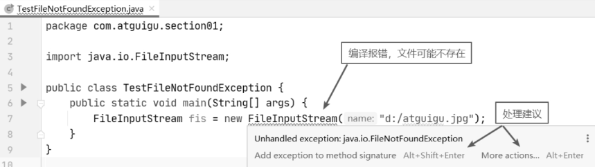

  - 运行时异常（RuntimeException）：属于非受检异常（Unchecked Exception），编译器不强制要求捕获。尽管这些异常可以捕获和处理，但大多数情况下，我们应该通过改进代码来避免它们。
    常见的运行时异常包括：

    - NullPointerException：尝试访问空对象的属性或方法时抛出。一旦发生空指针异常，就说明此时被访问对象为null，这种情况包括以下几种，

      - 调用null的实例方法。 
      - 访问或修改null的成员变量。
      -  将null作为一个数组，获得其长度。
      -  将null作为一个数组，访问或修改里面的元素。● 将null作为异常抛出。

      因此，在使用对象时，要时刻警惕该对象是否为null，或者在使用对象之前加if(xx ！=null)的条件判断。

    - ArrayIndexOutOfBoundsException：访问数组时索引超出数组的长度范围。

      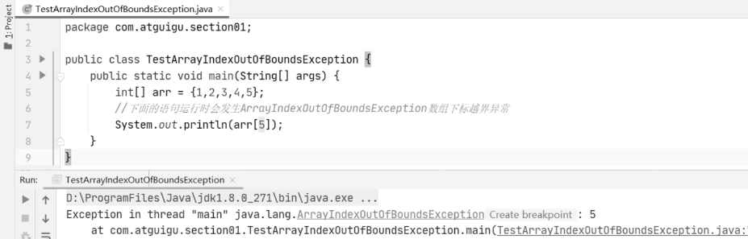

    - ArithmeticException：当进行一些数学运算时，如果违反了一些规则，就会发生算术异常。例如，两个整数相除，除数为0时，就会发生算术异常。所以，在编写数学运算相关的代码时，一定要严格遵守各种数学运算规则。

      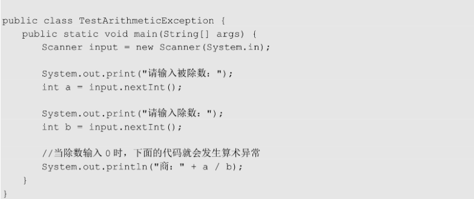

    - ClassCastException：类型转换异常。

      当试图将对象强制转换为它不属于的类型时，系统就会抛出该异常，所以在强制类型转换之前建议使用instanceof关键字进行判断，从而避免类型转换异常。

      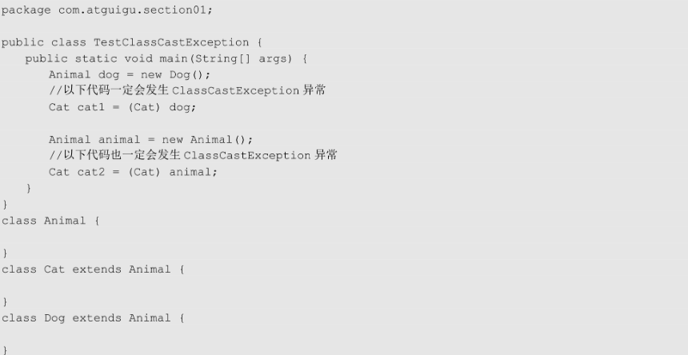

    - InputMismatchException：输入不匹配异常。

      我们之前使用Scanner类不同的next方法接收键盘输入的各种数据类型数据，但是Java语言是强类型语言，每种数据类型的宽度（字节数）是不同的，所以如果你输入的数据类型与要接收数据的类型不一致，那么将会发生输入不匹配异常。当检测到输入不匹配异常时，可以做相应的处理，让用户重新输入。

      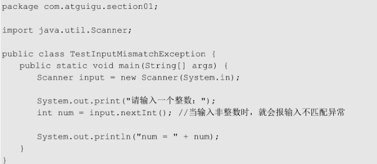

    - NumberFormatException：数字格式化异常

      当应用程序试图将字符串转换成一种数值类型，但该字符串不能转换为适当格式时，就会抛出数据格式化异常。在实际开发中，通常使用文本框接收用户输入的数据，而文本框中输入的数据不管是文字还是数字，都只能按字符串处理，然后在程序中需要转换为需要的数据类型，如转换为整数类型。

      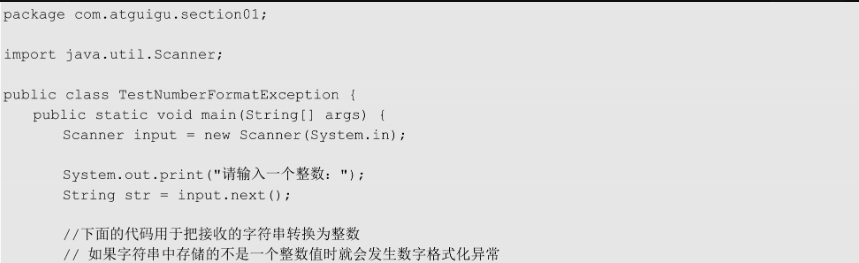

**Throwable中的常用方法：**

* `public void printStackTrace()`:打印异常的详细信息。

  *包含了异常的类型,异常的原因,还包括异常出现的位置,在开发和调试阶段,都得使用printStackTrace。*

* `public String getMessage()`:获取发生异常的原因。

  *提示给用户的时候,就提示错误原因。*

* `public String toString()`:获取异常的类型和异常描述信息(不用)。

***出现异常,不要紧张,把异常的简单类名,拷贝到API中去查。***


## 1.4 异常的产生过程解析

先运行下面的程序，程序会产生一个数组索引越界异常ArrayIndexOfBoundsException。我们通过图解来解析下异常产生的过程。

 工具类

```java
public class ArrayTools {
    // 对给定的数组通过给定的角标获取元素。
    public static int getElement(int[] arr, int index) {
        int element = arr[index];
        return element;
    }
}
```

 测试类

```java
public class ExceptionDemo {
    public static void main(String[] args) {
        int[] arr = { 34, 12, 67 };
        intnum = ArrayTools.getElement(arr, 4)
        System.out.println("num=" + num);
        System.out.println("over");
    }
}
```

上述程序执行过程图解：

 

## 1.7 异常处理

### try-catch-finally

（1）try-catch

```
try{
    //可能产生异常的代码
}catch(异常类型1 e){
    //当try中产生异常类型1的异常对象时的处置代码
}catch(异常类型2 e){
    //当try中产生异常类型2的异常对象时的处置代码
}
    //可以有更多个catch分支
    
    
```

- 如果try中没有遇到问题，怎么执行？

  - 会把try里面所有的代码全部执行完毕，不会执行catch里面的代码

  - 注意：只有当出现了异常才执行catch里面的代码

    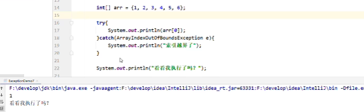

- 如果try中可能会遇到多个问题

  - 会写多个catch与之对应

  - 注意:这种异常处理方式，要求多个catch中的异常不能相同，并且若catch中的多个异常之间有子父类异常的关系，那么子类异常要求在上面的catch处理，父类异常在下面的catch处理。

  - 在jdk7以后，我们可以在catch中间同时捕获多个异常，中间用|进行隔开，表示如果出现了A异常或者B异常的话，采取同一种处理方案

    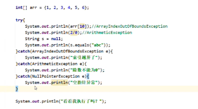

    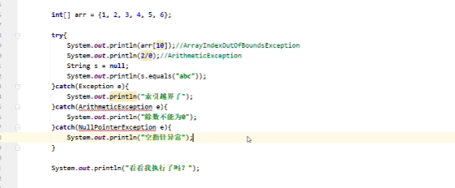

- 如果try中遇到的问题没有被捕获

  - 相当于try...catch的代码白写了，最终还是会交给虚拟机进行处理

    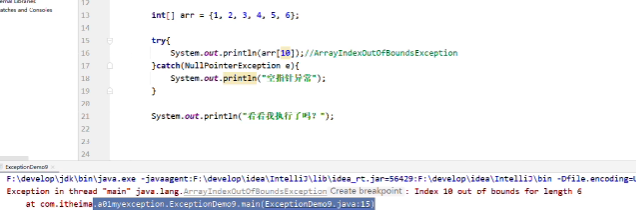

    

- 如果try中遇到问题，那么try下面的其他代码还会执行吗？

  - 下面的代码不会执行了，直接转到对应的catch中，执行catch里面的语句体。

  - 但是如果没有对应catch与之匹配，那么还是会交给虚拟机处理

    ```
    public class Exceptiondemo {
        public static void main(String[] args) {
                int[] arr={1,2,3,4,5};
                try{
                    System.out.println(arr[10]);
                    System.out.println("看看我执行了吗？。。。try");
                }catch(ArrayIndexOutofBoundsException e){
                    System.out.println("索引越界了");
                }
                
                System.out.println("看看我执行了吗？。。。其他代码");
            }
        
        }
    }
    ```

    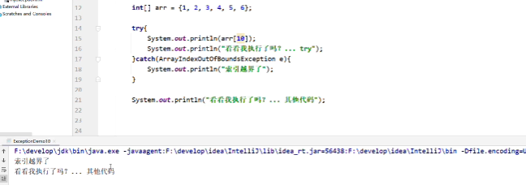

### 异常中的常见方法

Throwable类中定义了一些查看方法:

* `public String getMessage()`:获取异常的描述信息,原因(提示给用户的时候,就提示错误原因。

  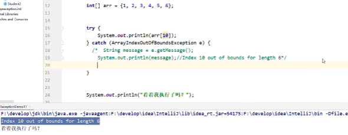


* `public String toString()`:获取异常的类型和异常描述信息(不用)。

  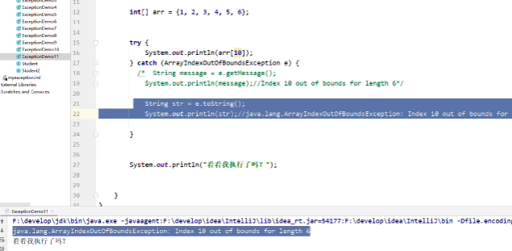

* `public void printStackTrace()`:打印异常的跟踪栈信息并输出到控制台。

  - **注意：仅仅是打印信息不会停止程序运行**

  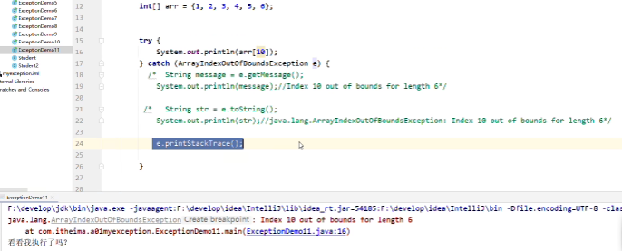

### 抛出异常

##### throws

注意：写在方法定义处，表示声明一个异常告诉调用者，使用本方法可能会有哪些异常。

```
public void 方法() throws 异常类名1,异常类名2...{
    ...
}
```

- 编译时异常：必须要写
- 运行时异常：可以不写

##### throw

注意：写方法内，结束方法手动抛出异常对象，交给调用者，方法中下面的代码不再执行了

```
public void 方法(){
    throw new NullPointerException
}
```

##### 案例：

```
public class Exceptiondemo {
    public static void main(String[] args) {
            int[] arr=null;
            int max=0;
            try{
            int max=getMax(arr);
            }catch(NullPointException e){
                e.printStackTrace();
            }catch(ArrayIndexOutOfBoundsException e){
                e.printStackTrace();
            }
            System.out.println(max);
    
    }
    
    public static int getMax(int[] arr){
        if(arr==null){
            //手动创建一个异常对象，并把这个异常交给方法的调用者处理
            //此时方法就会结束，下面的代码不会再执行了
            throw new NullPointerException();
        }
        
        if(arr.length==0){
            //手动创建一个异常对象，并把这个异常交给方法的调用者处理
            //此时方法就会结束，下面的代码不会再执行了
            throw new ArrayIndexOutBoundsException();
        }
        System.out.println("看看我执行了吗？");
        int max=arr[0];
        for(int i=1;i<arr.length;i++){
            if(arr[i]>max){
                max=arr[i];
            }
        }
        return max;
    }
}
```

##### 案例：

```
public class girlfriend {
    private String name;
    private int age;

    public girlfriend() {
    }

    public girlfriend(String name, int age) {
        this.name = name;
        this.age = age;
    }

    public String getName() {
        return name;
    }

    public void setName(String name) {
        int len=name.length();
        if(len<3||len>10){
            throw new RuntimeException();
        }
        this.name = name;
    }

    public int getAge() {

        return age;
    }

    public void setAge(int age) {
        if(age<18||age>40){
            throw new RuntimeException();
        }
        this.age = age;
    }
}

```

```
public class Test {
    public static void main(String[] args) {
        Scanner sc=new Scanner(System.in);
        girlfriend gf=new girlfriend();

        while (true) {
            try {
                System.out.println("请输入女朋友的名字：");
                String name=sc.nextLine();
                gf.setName(name);

                System.out.println("请输入女朋友的年龄：");
                int age= Integer.parseInt(sc.nextLine());
                gf.setAge(age);
                break;//如果所有的数据都是正确的，那么跳出循环
            } catch (NumberFormatException e) {
                System.out.println("年龄的格式有误，请输入数字");
                continue;//也可以不写
            }catch (RuntimeException e){
                System.out.println("姓名的长度 或者 年龄有误");
                continue;
            }
        }
        System.out.println(gf);

    }

}

```


### finally 代码块

**finally**：有一些特定的代码无论异常是否发生，都需要执行。另外，因为异常会引发程序跳转，导致有些语句执行不到。而finally就是解决这个问题的，在finally代码块中存放的代码都是一定会被执行的。

什么时候的代码必须最终执行？

当我们在try语句块中打开了一些物理资源(磁盘文件/网络连接/数据库连接等),我们都得在使用完之后,最终关闭打开的资源。

finally的语法:

 try...catch....finally:自身需要处理异常,最终还得关闭资源。

> 注意:finally不能单独使用。

比如在我们之后学习的IO流中，当打开了一个关联文件的资源，最后程序不管结果如何，都需要把这个资源关闭掉。

finally代码参考如下：

```java
public class TryCatchDemo4 {
    public static void main(String[] args) {
        try {
            read("a.txt");
        } catch (FileNotFoundException e) {
            //抓取到的是编译期异常  抛出去的是运行期 
            throw new RuntimeException(e);
        } finally {
            System.out.println("不管程序怎样，这里都将会被执行。");
        }
        System.out.println("over");
    }
    /*
     *
     * 我们 当前的这个方法中 有异常  有编译期异常
     */
    public static void read(String path) throws FileNotFoundException {
        if (!path.equals("a.txt")) {//如果不是 a.txt这个文件 
            // 我假设  如果不是 a.txt 认为 该文件不存在 是一个错误 也就是异常  throw
            throw new FileNotFoundException("文件不存在");
        }
    }
}
```

> 当只有在try或者catch中调用退出JVM的相关方法,此时finally才不会执行,否则finally永远会执行。

## 自定义异常

定义：

1.定义异常类

2.写继承关系

运行时异常:RuntimeException
编译时异常:Exception

3.空参构造

4.带参构造

#### 案例：

要求：我们模拟登陆操作，如果用户名已存在，则抛出异常并提示：亲，该用户名已经被注册。

首先定义一个登陆异常类LoginException：

```java
// 业务逻辑异常
public class LoginException extends Exception {
    /**
     * 空参构造
     */
    public LoginException() {
    }

    /**
     *
     * @param message 表示异常提示
     */
    public LoginException(String message) {
        super(message);
    }
}
```

模拟登陆操作，使用数组模拟数据库中存储的数据，并提供当前注册账号是否存在方法用于判断。

```java
public class Demo {
    // 模拟数据库中已存在账号
    private static String[] names = {"bill","hill","jill"};
   
    public static void main(String[] args) {     
        //调用方法
        try{
            // 可能出现异常的代码
            checkUsername("nill");
            System.out.println("注册成功");//如果没有异常就是注册成功
        } catch(LoginException e) {
            //处理异常
            e.printStackTrace();
        }
    }

    //判断当前注册账号是否存在
    //因为是编译期异常，又想调用者去处理 所以声明该异常
    public static boolean checkUsername(String uname) throws LoginException {
        for (String name : names) {
            if(name.equals(uname)){//如果名字在这里面 就抛出登陆异常
                throw new LoginException("亲"+name+"已经被注册了！");
            }
        }
        return true;
    }
}
```

#### 案例：

```
public class girlfriend {
    private String name;
    private int age;

    public girlfriend() {
    }

    public girlfriend(String name, int age) {
        this.name = name;
        this.age = age;
    }

    public String getName() {
        return name;
    }

    public void setName(String name) {
        int len=name.length();
        if(len<3||len>10){
            throw new NameformatException(name+"格式有误，长度为：3-10");
        }
        this.name = name;
    }

    public int getAge() {

        return age;
    }

    public void setAge(int age) {
        if(age<18||age>40){
            throw new AgeOutException(age+"超出了范围");
        }
        this.age = age;
    }
}

```

```
public class AgeOutException extends RuntimeException{
    public AgeOutException() {
    }

    public AgeOutException(String message) {
        super(message);
    }
}
```

```
public class NameformatException extends  RuntimeException{
        //运行时异常:RuntimeException
        //编译时异常:Exception


    public NameformatException() {
    }

    public NameformatException(String message) {
        super(message);
    }
}
```

```
public class Test {
    public static void main(String[] args) {
        Scanner sc=new Scanner(System.in);
        girlfriend gf=new girlfriend();

        while (true) {
            try {
                System.out.println("请输入女朋友的名字：");
                String name=sc.nextLine();
                gf.setName(name);

                System.out.println("请输入女朋友的年龄：");
                int age= Integer.parseInt(sc.nextLine());
                gf.setAge(age);
                break;//如果所有的数据都是正确的，那么跳出循环
            } catch (NumberFormatException e){
                e.printStackTrace();
            }
            catch (NameformatException e) {
                e.printStackTrace();
            }catch (AgeOutException e){
                e.printStackTrace();
            }
        }
        System.out.println(gf);

    }

}

```

# File类

## 概述

`java.io.File` 类是文件和目录路径名的抽象表示，主要用于文件和目录的创建、查找和删除等操作。

**File对象表示路径，可以是文件，也可以是文件夹。这个路径可以是存在的，也可以是不存在。**

## **Java 中的路径分隔符**

1. **路径分隔符的问题**

在 Windows 系统中，路径使用反斜杠 `\` 作为分隔符，例如：

```
C:\Users\John\Documents\file.txt
```

但在 Java 中，字符串中的 `\` 是转义字符，所以要表示一个实际的 `\`，必须写成 `\\`：

```
String path = "C:\\Users\\John\\Documents\\file.txt";
```

2. **更推荐的方式：使用正斜杠 `/`**

Java 支持将正斜杠 `/` 作为与平台无关的路径分隔符，即使在 Windows 上也能正常工作：

```
String path = "C:/Users/John/Documents/file.txt";
```

3. **使用 File.separator 常量**

为了实现**完全平台无关**的路径拼接，可以使用 `File.separator` 或 `FileSystems.getDefault().getSeparator()`：

```
String path = "C:" + File.separator + "Users" + File.separator + "John" + File.separator + "file.txt";
```

输出：

- Windows：`C:\Users\John\file.txt`
- Linux/macOS：`C:/Users/John/file.txt`

⚠️ 注意：这种方式虽然通用，但通常不推荐手动拼接路径，而是使用更现代的方式，如 `Paths.get()`。

4. **推荐方式：使用 Paths.get()**

Java 7 引入了 `java.nio.file.Paths`，可以更安全、简洁地处理路径：

```
import java.nio.file.Paths;

public class PathExample {
    public static void main(String[] args) {
        String path = Paths.get("C:", "Users", "John", "file.txt").toString();
        System.out.println(path);
    }
}
```

输出（Windows）：C:\Users\John\file.txt

这种方式：

- 自动处理路径分隔符
- 可跨平台使用
- 更加安全和清晰

5. **路径中的特殊符号**

| 符号 | 含义                                              | 示例                   |
| ---- | ------------------------------------------------- | ---------------------- |
| `.`  | 当前目录                                          | `./data.txt`           |
| `..` | 上一级目录                                        | `../config.properties` |
| `/`  | 根目录（在 Windows 中等价于盘符根目录，如 `C:/`） | `/Users/John/file.txt` |

------

6. **路径是否以根目录开始**

- **绝对路径**：以根目录开始，如 `/home/user/file.txt` 或 `C:/Users/file.txt`
- **相对路径**：相对于当前工作目录，如 `data/file.txt` 或 `./logs`

案例：

```
import java.nio.file.Path;
import java.nio.file.Paths;

public class AbsoluteRelativeExample {
    public static void main(String[] args) {

        // 使用 Paths.get() 创建一个相对路径 Path 对象
        // 相对路径：表示相对于当前工作目录的路径
        // 该路径表示当前目录下的 "data" 文件夹中的 "file.txt" 文件
        Path relative = Paths.get("data", "file.txt");

        // 使用 Paths.get() 创建一个绝对路径 Path 对象
        // 绝对路径：表示从根目录开始的完整路径
        // 该路径表示从 "C:/" 根目录开始，进入 "data" 文件夹，找到 "file.txt"
        Path absolute = Paths.get("C:/", "data", "file.txt");

        // 打印相对路径的字符串表示
        System.out.println("Relative Path: " + relative.toString());

        // 打印绝对路径的字符串表示
        System.out.println("Absolute Path: " + absolute.toString());

        // 判断该路径是否为绝对路径
        // 返回 true 表示是绝对路径，false 表示是相对路径
        System.out.println("Is Absolute? " + absolute.isAbsolute());
    }
}
```

案例：

```
public class FilePath {
    public static void main(String[] args) {
        
        // 创建一个 File 对象，表示 D 盘根目录下的 bbb.java 文件
        // 使用双反斜杠 "\\" 表示一个实际的路径分隔符 "\"
        File f = new File("D:\\bbb.java");
        
        // 打印该文件的绝对路径
        System.out.println(f.getAbsolutePath());
        
        // 创建一个 File 对象，表示当前项目目录下的 bbb.java 文件
        // 这是一个相对路径
        File f2 = new File("bbb.java");
        
        // 打印该文件的绝对路径（相对于当前工作目录）
        System.out.println(f2.getAbsolutePath());
    }
}

输出：D:\bbb.java
D:\idea_project_test4\bbb.java
```


## 构造方法

- `public File(String pathname) ` ：通过将给定的**路径名字符串**转换为抽象路径名来创建新的 File实例。  
- `public File(String parent, String child) ` ：从**父路径名字符串和子路径名字符串**创建新的 File实例。
- `public File(File parent, String child)` ：从**父抽象路径名和子路径名字符串**创建新的 File实例。  
- 构造举例，代码如下：

```java
// 文件路径名
String pathname = "D:\\aaa.txt";
File file1 = new File(pathname); 

// 文件路径名
String pathname2 = "D:\\aaa\\bbb.txt";
File file2 = new File(pathname2); 
System.out.println(file2)//  "D:\aaa\bbb.txt"

// 通过父路径和子路径字符串
 String parent = "d:\\aaa";//父级路径
 String child = "bbb.txt"; //子级路径
 File file3 = new File(parent, child);
System.out.println(file3)//  "d:\aaa\bbb.txt" 

// 通过父级File对象和子路径字符串
File parentDir = new File("d:\\aaa");
String child = "bbb.txt";
File file4 = new File(parentDir, child);
```

> 小贴士：
>
> 1. 一个File对象代表硬盘中实际存在的一个文件或者目录。
> 2. 无论该路径下是否存在文件或者目录，都不影响File对象的创建。

## 常用方法

### 获取功能的方法

- `public String getAbsolutePath() ` ：返回此File的绝对路径名字符串。

- ` public String getPath() ` ：将此File转换为路径名字符串。 

- `public String getName()`  ：返回由此File表示的文件或目录的名称。  

- `public long length()`  ：返回File对象对应的文件的内容的长度（字节数）。如果File对象对应的是目录，则结果是不确定的。

  **细节1：**这个方法只能获取文件的大小，单位是字节。如果单位我们要是M，G，可以不断的除以1024。

  **细节2：**这个方法无法获取文件夹的大小。
  
  如果我们要获取一个文件夹的大小，需要把这个文件夹里面的所有的文件大小都加在一起。
  
- `public long lastModified()`：返回文件的最后修改时间（时间毫秒值） 

- `String getParent()`：返回此File对象所表示的文件或目录名（返回最后一级）

- `File getParentFile()`返回此File对象的父目录名所对应的File对象

  方法演示，代码如下：

  ```java
  public class FileGet {
      public static void main(String[] args) {
          File f = new File("d:\\aaa\\bbb.java");     
          System.out.println("文件绝对路径:"+f.getAbsolutePath());
          System.out.println("文件构造路径:"+f.getPath());
          System.out.println("文件名称:"+f.getName());
          System.out.println("文件长度:"+f.length()+"字节");
  
          File f2 = new File("d:\\aaa");     
          System.out.println("目录绝对路径:"+f2.getAbsolutePath());
          System.out.println("目录构造路径:"+f2.getPath());
          System.out.println("目录名称:"+f2.getName());
          System.out.println("目录长度:"+f2.length());
      }
  }
  输出结果：
  文件绝对路径:d:\aaa\bbb.java
  文件构造路径:d:\aaa\bbb.java
  文件名称:bbb.java
  文件长度:636字节
  
  目录绝对路径:d:\aaa
  目录构造路径:d:\aaa
  目录名称:aaa
  目录长度:4096
  ```

> API中说明：length()，表示文件的长度。但是File对象表示目录，则返回值未指定。

### 判断功能的方法

- `public boolean exists()` ：此File表示的文件或目录是否实际存在。
- `public boolean isDirectory()` ：此File表示的是否为目录。
- `public boolean isFile()` ：此File表示的是否为文件。
- `boolean canRead()`：判断File对象对应的文件或目录是否可读 
- `boolean canWrite()`：判断File对象对应的文件或目录是否可写
- `boolean isHidden()`：判断File对象对应的文件或目录是否隐藏

方法演示，代码如下：

```java
public class FileIs {
    public static void main(String[] args) {
        File f = new File("d:\\aaa\\bbb.java");
        File f2 = new File("d:\\aaa");
      	// 判断是否存在
        System.out.println("d:\\aaa\\bbb.java 是否存在:"+f.exists());
        System.out.println("d:\\aaa 是否存在:"+f2.exists());
      	// 判断是文件还是目录
        System.out.println("d:\\aaa 文件?:"+f2.isFile());
        System.out.println("d:\\aaa 目录?:"+f2.isDirectory());
    }
}
输出结果：
d:\aaa\bbb.java 是否存在:true
d:\aaa 是否存在:true
d:\aaa 文件?:false
d:\aaa 目录?:true
```

### 创建删除功能的方法

- `public boolean createNewFile()` ：当且仅当具有该名称的文件尚不存在时，创建一个新的空文件。 
- `public boolean delete()` ：删除由此File表示的文件或目录。  delete方法默认只能删除文件和空文件夹，delete方法直接删除不走回收站。
- `public boolean mkdir()` ：创建由此File表示的目录。
- `public boolean mkdirs()` ：创建由此File表示的目录，包括任何必需但不存在的父目录。既可以创建单级又可以创建多级

方法演示，代码如下：

```java
public class FileCreateDelete {
    public static void main(String[] args) throws IOException {
        
        // 文件的创建
        File f = new File("aaa.txt");
        System.out.println("是否存在:"+f.exists()); // false
        System.out.println("是否创建:"+f.createNewFile()); // true
        System.out.println("是否存在:"+f.exists()); // true
		
     	// 目录的创建
      	File f2= new File("newDir");	
        System.out.println("是否存在:"+f2.exists());// false
        System.out.println("是否创建:"+f2.mkdir());	// true
        System.out.println("是否存在:"+f2.exists());// true

		// 创建多级目录
      	File f3= new File("newDira\\newDirb");
        System.out.println(f3.mkdir());// false
        File f4= new File("newDira\\newDirb");
        System.out.println(f4.mkdirs());// true
      
      	// 文件的删除
       	System.out.println(f.delete());// true
      
      	// 目录的删除
        System.out.println(f2.delete());// true
        System.out.println(f4.delete());// false
    }
}
```

> API中说明：delete方法，如果此File表示目录，则目录必须为空才能删除。

## 目录的遍历

- `public String[] list()` ：返回一个String数组，表示该File目录中的所有子文件或目录。

- `public File[] listFiles()` ：返回一个File数组，表示该File目录中的所有的子文件或目录。  
  - 当调用者File表示的路径不存在时，返回null
  
  - 当调用者File表示的路径是文件时，返回null
  
  - 当调用者File表示的路径是一个空文件夹时，返回一个长度为0的数组
  
  - 当调用者File表示的路径是一个有内容的文件夹时，将里面所有文件和文件夹的路径放在File数组中返回
  - 当调用者File表示的路径是一个有隐藏文件的文件夹时，将里面所有文件和文件夹的路径放在File数组中返回，包含隐藏文件
  - 当调用者File表示的路径是需要权限才能访问的文件夹时，返回null

```java
public class FileFor {
    public static void main(String[] args) {
        File dir = new File("d:\\java_code");
      
      	//获取当前目录下的文件以及文件夹的名称。
		String[] names = dir.list();
		for(String name : names){
			System.out.println(name);
		}
        //获取当前目录下的文件以及文件夹对象，只要拿到了文件对象，那么就可以获取更多信息
        File[] files = dir.listFiles();
        for (File file : files) {
            System.out.println(file);
        }
    }
}
```

> 小贴士：
>
> 调用listFiles方法的File对象，表示的必须是实际存在的目录，否则返回null，无法进行遍历。

## File的常见成员方法（获取并遍历）

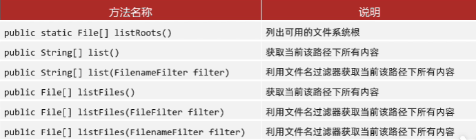

```
public class FileDemo {
    public static void main(String[] args) {
        //1.listRoots获取系统中所有的盘符
        File[] arr=File.listRoots();
        System.out.println(Arrays.toString(arr));//[C:\, D:\, E:\]

        //2.list() 获取当前该路径下所有内容（仅仅能获取名字）
        /*File f1=new File("D:\\aaa");
        String[] arr1=f1.list();
        for(String s:arr1){
            System.out.println(s);//aaa.txt
        }*/

        //3.list(FilenameFilter filter) 获取当前该路径下所有内容（过滤）
        //需求：我现在要获取D:\\aaa目录下所有的以.txt结尾的文件
        //accept方法的形参，依次表示aaa文件夹里面每一个文件或者文件夹的路径
        //参数一：父级路径
        //参数二：子级路径
        //返回值：true表示保留，false表示过滤掉
        File f2=new File("D:\\aaa");
        String[] arr3=f2.list(new FilenameFilter() {
            @Override
            public boolean accept(File dir, String name) {
                File src=new File(dir,name);
                if(src.isFile()&&name.endsWith(".txt")){
                    return true;
                }else {
                    return false;
                }
                //return false;//null
                //return true
            }
        });
        System.out.println(Arrays.toString(arr3));
    }
}

```


## 综合练习

#### 练习1：创建文件夹

​	在当前模块下的aaa文件夹中创建一个a.txt文件

代码实现：

```java
public class Test1 {
    public static void main(String[] args) throws IOException {
        //需求：在当前模块下的aaa文件夹中创建一个a.txt文件

        //1.创建a.txt的父级路径
        File file = new File("myfile\\aaa");
        //2.创建父级路径
        //如果aaa是存在的，那么此时创建失败的。
        //如果aaa是不存在的，那么此时创建成功的。
        file.mkdirs();
        //3.拼接父级路径和子级路径
        File src = new File(file,"a.txt");
        boolean b = src.createNewFile();
        if(b){
            System.out.println("创建成功");
        }else{
            System.out.println("创建失败");
        }
    }
}
```

#### 练习2：查找文件（不考虑子文件夹）

​	定义一个方法找某一个文件夹中，是否有以avi结尾的电影（暂时不需要考虑子文件夹）

代码示例：

```java
public class Test2 {
    public static void main(String[] args) {
        /*需求：
             定义一个方法找某一个文件夹中，是否有以avi结尾的电影。
	        （暂时不需要考虑子文件夹）
        */

        File file = new File("D:\\aaa\\bbb");
        boolean b = haveAVI(file);
        System.out.println(b);
    }
    /*
    * 作用：用来找某一个文件夹中，是否有以avi结尾的电影
    * 形参：要查找的文件夹
    * 返回值：查找的结果  存在true  不存在false
    * */
    public static boolean haveAVI(File file){// D:\\aaa
        //1.进入aaa文件夹，而且要获取里面所有的内容
        File[] files = file.listFiles();
        //2.遍历数组获取里面的每一个元素
        for (File f : files) {
            //f：依次表示aaa文件夹里面每一个文件或者文件夹的路径
            if(f.isFile() && f.getName().endsWith(".avi")){
                return true;
            }
        }
        //3.如果循环结束之后还没有找到，直接返回false
        return false;
    }
}
```

#### 练习3：（考虑子文件夹）

​	找到电脑中所有以avi结尾的电影。（需要考虑子文件夹）

代码示例：

```java
public class Test3 {
    public static void main(String[] args) {
        /* 需求：
        找到电脑中所有以avi结尾的电影。（需要考虑子文件夹）


        套路：
            1，进入文件夹
            2，遍历数组
            3，判断
            4，判断

        */

        findAVI();

    }

    public static void findAVI(){
        //获取本地所有的盘符
        File[] arr = File.listRoots();
        for (File f : arr) {
            findAVI(f);
        }
    }

    public static void findAVI(File src){//"C:\\
        //1.进入文件夹src
        File[] files = src.listFiles();
        //2.遍历数组,依次得到src里面每一个文件或者文件夹
        if(files != null){
            for (File file : files) {
                if(file.isFile()){
                    //3，判断，如果是文件，就可以执行题目的业务逻辑
                    String name = file.getName();
                    if(name.endsWith(".avi")){
                        System.out.println(file);
                    }
                }else{
                    //4，判断，如果是文件夹，就可以递归
                    //细节：再次调用本方法的时候，参数一定要是src的次一级路径
                    findAVI(file);
                }
            }
        }
    }
}
```

#### 练习4：删除多级文件夹

需求： 如果我们要删除一个有内容的文件夹
	   1.先删除文件夹里面所有的内容
           2.再删除自己

代码示例：

```java
public class Test4 {
    public static void main(String[] args) {
        /*
           删除一个多级文件夹
           如果我们要删除一个有内容的文件夹
           1.先删除文件夹里面所有的内容
           2.再删除自己
        */

        File file = new File("D:\\aaa\\src");
        delete(file);

    }

    /*
    * 作用：删除src文件夹
    * 参数：要删除的文件夹
    * */
    public static void delete(File src){
        //1.先删除文件夹里面所有的内容
        //进入src
        File[] files = src.listFiles();
        //遍历
        for (File file : files) {
            //判断,如果是文件，删除
            if(file.isFile()){
                file.delete();
            }else {
                //判断,如果是文件夹，就递归
                delete(file);
            }
        }
        //2.再删除自己
        src.delete();
    }
}
```

#### 练习5：统计大小

​	需求：统计一个文件夹的总大小

代码示例：

```java
public class Test5 {
    public static void main(String[] args) {
       /*需求：
            统计一个文件夹的总大小
      */


        File file = new File("D:\\aaa\\src");

        long len = getLen(file);
        System.out.println(len);//4919189
    }

    /*
    * 作用：
    *       统计一个文件夹的总大小
    * 参数：
    *       表示要统计的那个文件夹
    * 返回值：
    *       统计之后的结果
    *
    * 文件夹的总大小：
    *       说白了，文件夹里面所有文件的大小
    * */
    public static long getLen(File src){
        //1.定义变量进行累加
        long len = 0;
        //2.进入src文件夹
        File[] files = src.listFiles();
        //3.遍历数组
        for (File file : files) {
            //4.判断
            if(file.isFile()){
                //我们就把当前文件的大小累加到len当中
                len = len + file.length();
            }else{
                //判断，如果是文件夹就递归
                len = len + getLen(file);
            }
        }
        return len;
    }
}
```

#### 练习6：统计文件个数

  需求：统计一个文件夹中每种文件的个数并打印。（考虑子文件夹）
            打印格式如下：
            txt:3个
            doc:4个
            jpg:6个

代码示例：

```java
public class Test6 {
    public static void main(String[] args) throws IOException {
        /*
            需求：统计一个文件夹中每种文件的个数并打印。（考虑子文件夹）
            打印格式如下：
            txt:3个
            doc:4个
            jpg:6个
        */
        File file = new File("D:\\aaa\\src");
        HashMap<String, Integer> hm = getCount(file);
        System.out.println(hm);
    }

    /*
    * 作用：
    *       统计一个文件夹中每种文件的个数
    * 参数：
    *       要统计的那个文件夹
    * 返回值：
    *       用来统计map集合
    *       键：后缀名 值：次数
    *
    *       a.txt
    *       a.a.txt
    *       aaa（不需要统计的）
    *
    *
    * */
    public static HashMap<String,Integer> getCount(File src){
        //1.定义集合用来统计
        HashMap<String,Integer> hm = new HashMap<>();
        //2.进入src文件夹
        File[] files = src.listFiles();
        //3.遍历数组
        for (File file : files) {
            //4.判断，如果是文件，统计
            if(file.isFile()){
                //a.txt
                String name = file.getName();
                String[] arr = name.split("\\.");
                if(arr.length >= 2){
                    String endName = arr[arr.length - 1];
                    if(hm.containsKey(endName)){
                        //存在
                        int count = hm.get(endName);
                        count++;
                        hm.put(endName,count);
                    }else{
                        //不存在
                        hm.put(endName,1);
                    }
                }
            }else{
                //5.判断，如果是文件夹，递归
                //sonMap里面是子文件中每一种文件的个数
                HashMap<String, Integer> sonMap = getCount(file);
                //hm:  txt=1  jpg=2  doc=3
                //sonMap: txt=3 jpg=1
                //遍历sonMap把里面的值累加到hm当中
                Set<Map.Entry<String, Integer>> entries = sonMap.entrySet();
                for (Map.Entry<String, Integer> entry : entries) {
                    String key = entry.getKey();
                    int value = entry.getValue();
                    if(hm.containsKey(key)){
                        //存在
                        int count = hm.get(key);
                        count = count + value;
                        hm.put(key,count);
                    }else{
                        //不存在
                        hm.put(key,value);
                    }
                }
            }
        }
        return hm;
    }
}
```


